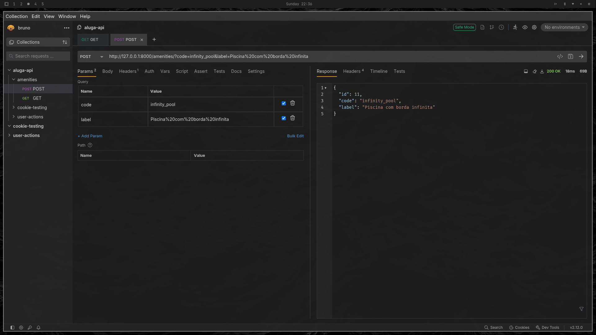
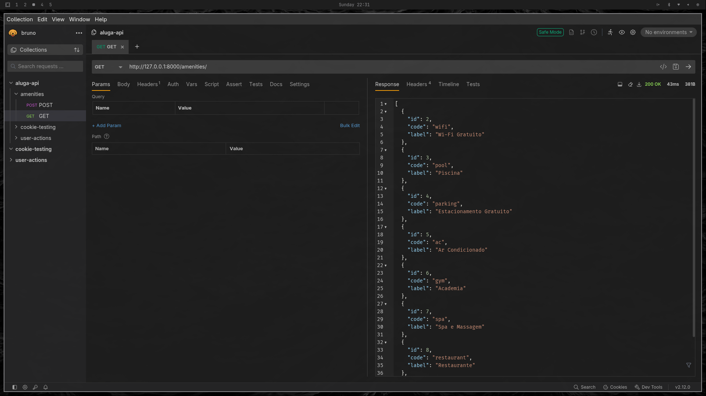
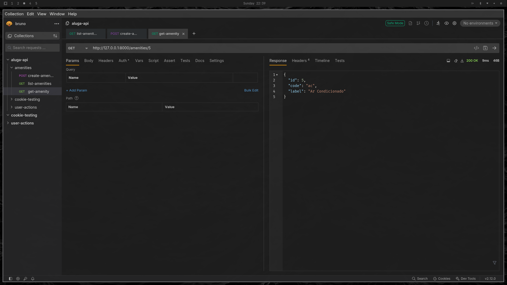
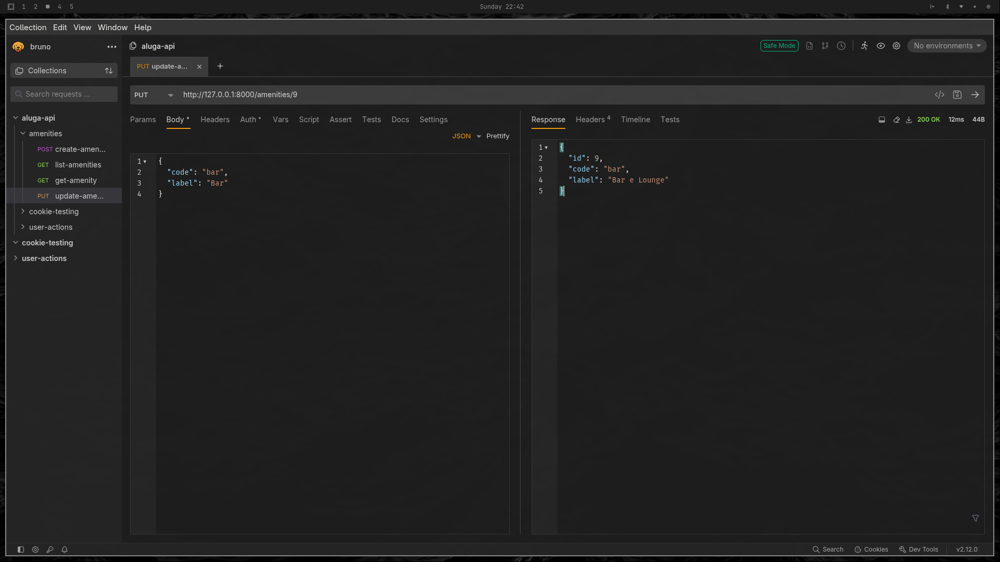
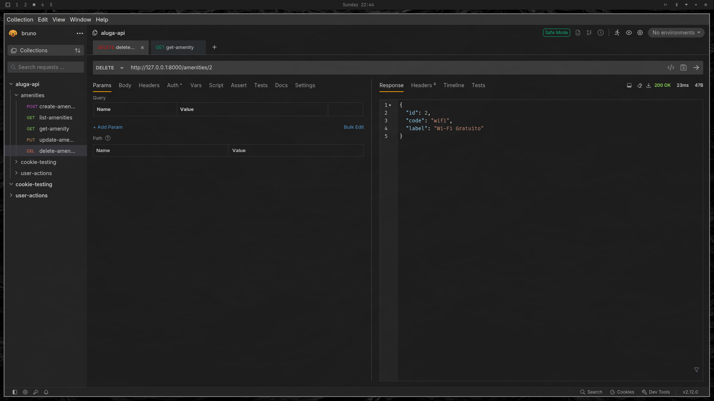

# Relatório de Testes de API & Evidências — Comodidades (Amenities)

Este documento registra os testes do CRUD de comodidades, com endpoints, payloads, respostas e evidências de teste.

## Visão Geral dos Testes

| **Projeto**     | `aluga-api`                         |
| --------------- | ----------------------------------- |
| **Ambiente**    | `Ambiente de desenvolvimento local` |
| **Date**        | 05/10/2025                          |
| **Ferramentas** | Curl / Bruno                        |

---

##  Casos de Teste

### 1. `POST /amenities/`
**Objetivo**: Criar uma nova comodidade.
- Método: POST
- URL: `/amenities/?code={code}&label={label}`
- Parâmetros:
```json
{
  "code": "wifi",
  "label": "Wi-Fi Gratuito"
}
```
- Resposta:
- Sucesso (201 Created)
```json
{
	"id": 1,
	"code": "wifi",
	"label": "Wi-Fi Gratuito"
}
```
- Erros possíveis:
- 400 Bad Request → Campos obrigatórios ausentes
- 409 Conflict → Comodidade já existe
- Evidências:


---
### 2. `GET /amenities/`
**Objetivo**: Listar todas as comodidades cadastradas.
- Método: GET
- URL: `/amenities/`
- Resposta:
- Sucesso (200 OK)
```json
[
	{
	"id": 1,
	"code": "wifi",
	"label": "Wi-Fi Gratuito"
	},
	{
	"id": 2,
	"code": "pool",
	"label": "Piscina"
	}
]
```
- Evidências: 


---
### 3. `GET /amenities/{id}`
**Objetivo**: Buscar uma comodidade por ID.
- Método: GET
- URL: `/amenities/{id}`
- Resposta:
- Sucesso (200 OK)
```json
{
  "id": 1,
  "code": "wifi",
  "label": "Wi-Fi Gratuito"
}
```
- Erro (404 Not Found)
```json
{
  "detail": "Amenity not found"
}
```
- Evidências:


---
### 4. `PUT /amenities/{id}`
**Objetivo**: Atualizar o label de uma comodidade.
- Método: PUT
- URL: `amenities/{id}?label={novo_label}`
- Resposta:
- Sucesso (200 OK)
```json
{
  "id": 1,
  "code": "wifi",
  "label": "Wi-Fi Premium"
}
```
- Erros possíveis:
- 404 Not Found → Comodidade não encontrada
- 422 Unprocessable Entity → Label inválido ou vazio
- Evidências:



---
### 5. `DELETE /amenities/{id}`

**Objetivo**: Deletar uma comodidade.
- Método: DELETE
- URL: `/amenities/{id}`
- Resposta:
- Sucesso (204 No Content)
```json
{}
```


- Erros possíveis:
- 404 Not Found → Comodidade não encontrada
- 409 Conflict → Comodidade associada a hotéis

- Evidências:

