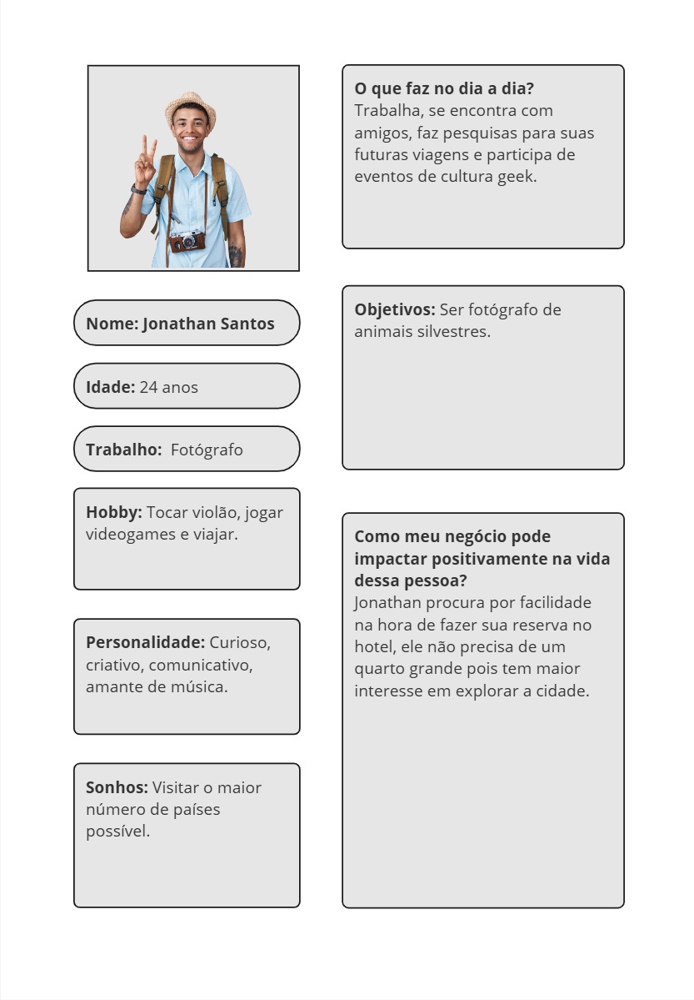
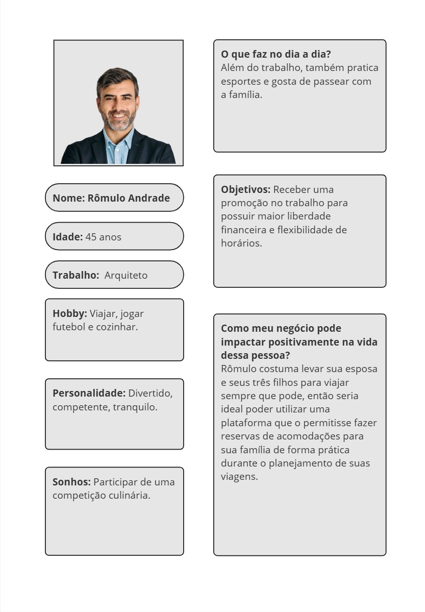
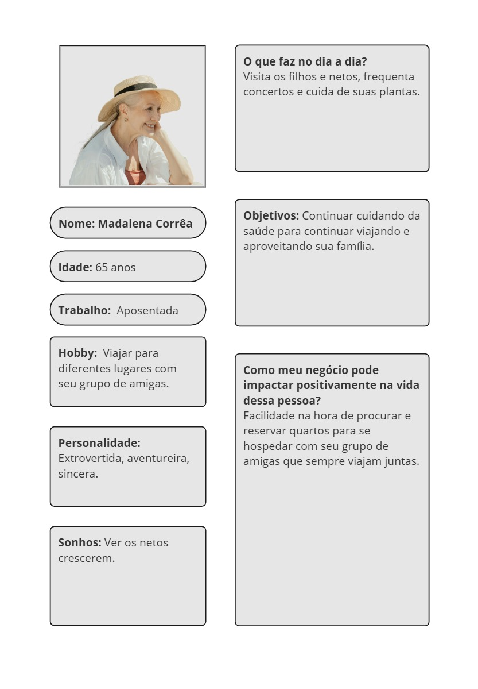
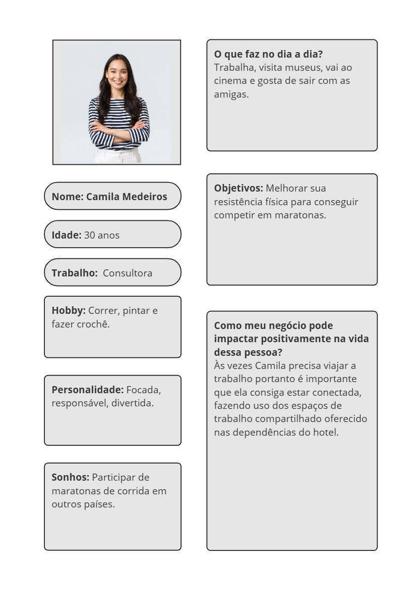
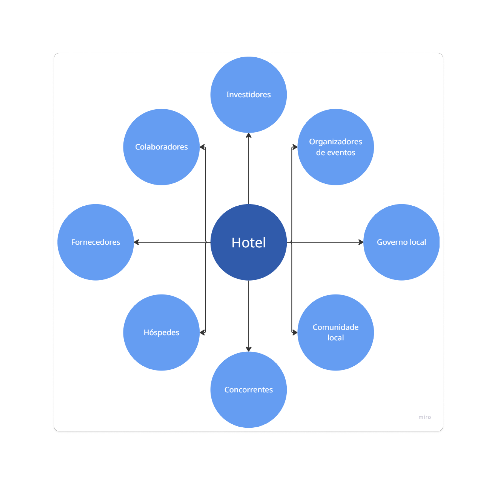

# Introdução

  Viajar e escolher uma hospedagem envolve decisões que vão além da simples disponibilidade de quartos. Informações claras, organizadas e confiáveis sobre acomodações, serviços e localização tornaram-se cada vez mais importantes à medida que o setor de turismo se digitaliza e se torna mais competitivo.

  Nesse cenário, os clientes estão cada vez mais bem informados e exigentes, comparando opções, avaliando serviços e buscando experiências que combinem conforto, praticidade e lazer. Atender a essas expectativas exige sistemas capazes de fornecer informações atualizadas e precisas de forma rápida e acessível. As aplicações distribuídas desempenham um papel essencial nesse contexto, permitindo que plataformas digitais escalem para atender simultaneamente múltiplos usuários e estabelecimentos, integrem dados de diferentes fontes e mantenham a disponibilidade e confiabilidade das informações. Dessa forma, elas tornam-se ferramentas estratégicas para conectar clientes e hotéis em um ambiente altamente competitivo e dinâmico, onde a experiência do usuário é um diferencial decisivo.

  No entanto, apesar dessas tecnologias, desafios persistem na forma como as informações são apresentadas e consumidas pelos clientes, o que evidencia a necessidade de soluções digitais mais eficazes — exatamente o problema que este projeto busca abordar.

  ## Problema

  O setor de hotelaria e turismo no Brasil passou por uma transformação digital intensa nos últimos cinco anos, acelerada especialmente pela pandemia de COVID-19 (FOHB, 2023). A forma de escolher hospedagens mudou radicalmente: se antes os clientes buscavam informações por contato direto com os hotéis ou visitas presenciais, hoje a maior parte das reservas é realizada por plataformas digitais, conhecidas como OTAs (Online Travel Agencies), permitindo comparar preços, serviços, avaliações e localização em poucos cliques. Em 2023, por exemplo, cerca de 70% das reservas de hotéis urbanos vieram de OTAs (FOHB, 2023), evidenciando a dependência do setor em relação a esses canais digitais.  

  Apesar da praticidade, essa transformação também trouxe desafios significativos. Um dos principais problemas é a apresentação de informações desatualizadas, inconsistentes ou pouco claras sobre quartos, preços e serviços, gerando insegurança e frustração no processo de escolha (TripAdvisor, 2024; Revista Hotéis, 2023). Isso pode resultar em reservas inválidas, divergências entre o contratado e o oferecido no check-in, ou dificuldade no cancelamento e alterações (Diário do Comércio, 2021). Estudos indicam que 45% dos viajantes usam smartphones para realizar reservas, e 34% esperam check-in digital (TripAdvisor, 2024), o que aumenta a exigência por sistemas digitais confiáveis e eficientes.  

  Para os clientes, essas falhas significam perda de tempo, frustração e quebra de confiança em plataformas e estabelecimentos. Para os hotéis, os impactos incluem perda de oportunidades de venda, avaliações públicas negativas e dificuldades para fidelizar hóspedes, especialmente em um mercado altamente competitivo (FOHB, 2023; MaxMilhas, 2023).  

  Diante desse cenário, torna-se essencial desenvolver soluções digitais que organizem e atualizem informações em tempo real, integrando diferentes fontes de dados. Tais sistemas garantiriam uma experiência de busca e reserva transparente, segura e satisfatória, beneficiando tanto clientes quanto estabelecimentos e fortalecendo a competitividade do setor.

  ## Objetivo geral

  Desenvolver uma plataforma digital para o setor hoteleiro que organize e disponibilize informações de forma clara e confiável, proporcionando uma experiência de reserva segura, eficiente e satisfatória para os clientes, ao mesmo tempo em que reduz erros operacionais e melhora a gestão de processos dos hotéis.

  ### Objetivos específicos

  A plataforma deve permitir:

  - Cadastro de usuários de forma simples e segura
  - Pesquisa de quartos utilizando filtros para facilitar a escolha
  - Realização de reservas, com opção de alteração ou cancelamento de acordo com a necessidade do hóspede
  - Pagamentos por diferentes meios de forma segura
  - Avaliação do serviço após a estadia, garantindo feedbacks confiáveis
  - Atualização automática de disponibilidade e informações de quartos, evitando inconsistências e reservas inválidas

  ## Justificativa

  O projeto se justifica pela necessidade de consolidar os conhecimentos adquiridos em semestres anteriores e aplica-los na criação de uma solução prática e funcional para o setor hoteleiro. A plataforma proposta visa facilitar a experiência de reservas online, oferecendo informações claras, atualizadas e confiáveis sobre quartos, preços e serviços. Dessa forma, é possível reduzir surpresas para os usuários, como indisponibilidade, cobranças inesperadas ou divergências entre o que foi contratado e o que é efetivamente oferecido.

  Além de beneficiar os clientes, a solução contribui para a eficiência operacional dos hotéis, organizando processos, integrando dados de diferentes fontes e garantindo maior confiabilidade e agilidade nas operações. Assim, a plataforma não apenas melhora a experiência de busca e reserva, mas também fortalece a competitividade das empresas do setor em um mercado cada vez mais digital e orientado à experiência do usuário.

  ## Público-Alvo

  O principal público-alvo da plataforma são os hóspedes, que apresentam perfis e necessidades distintas durante a estadia. Entre eles estão:

  - **Turistas de lazer**, que utilizam o hotel principalmente para descanso enquanto exploram a cidade;
  - **Famílias e grupos**, que buscam tanto acomodações confortáveis quanto áreas de lazer disponíveis no hotel;
  - **Viajantes a trabalho**, que geralmente têm estadias curtas e utilizam espaços de coworking e serviços voltados para produtividade.

  A diversidade de perfis reforça a necessidade de uma plataforma que organize informações de forma clara, permita pesquisas personalizadas e ofereça reservas seguras, atendendo de maneira eficiente às expectativas de cada tipo de hóspede.

  ## Diagramas de personas

  | Jonathan Santos                        |
  | -------------------------------------- |
  |  |

  | Rômulo Andrade                       |
  | ------------------------------------ |
  |  |

  | Madalena Corrêa                        |
  | -------------------------------------- |
  |  |

  | Camila Medeiros                      |
  | ------------------------------------ |
  |  |

## Mapa de Stakeholders

O mapa de stakeholders do sistema de catálogo de hotéis apresenta os principais atores envolvidos no processo de escolha de hospedagem e sua relação com o sistema. Ele permite compreender o papel de cada parte interessada, destacando suas necessidades e expectativas.

### Descrição

- **Clientes**: usuários finais que utilizam o catálogo para buscar, comparar e selecionar hotéis.  
- **Hotéis**: fornecedores de acomodações que disponibilizam informações sobre quartos, tarifas e serviços.  
- **Plataforma de Catálogo**: sistema responsável por consolidar e apresentar as informações de forma clara e confiável.  
- **Administradores da Plataforma**: responsáveis pela gestão, atualização e manutenção do catálogo.  
- **Parceiros Comerciais**: agências de turismo e plataformas de reservas integradas que se beneficiam do catálogo.  

### Representação Gráfica

A figura abaixo apresenta o **Mapa de Stakeholders** do sistema:

  # Especificações do Projeto

  ## Requisitos

  As tabelas a seguir apresentam os **requisitos funcionais (RFs)** e **não funcionais (RNFs)** que detalham o escopo do projeto. Para determinar a prioridade de cada requisito, foi utilizada a **técnica MoSCoW**, que classifica os itens em:

  - **M – Must have (Deve ter)** – Essencial para o funcionamento do sistema e cumprimento dos objetivos do projeto.  
  - **S – Should have (Deveria ter)** – Importante, mas pode ser simplificado ou parcialmente implementado na entrega acadêmica.  
  - **C – Could have (Poderia ter)** – Desejável, mas não essencial; pode ser considerado como melhoria futura.  

  A aplicação da técnica considerou **impacto no usuário, dependência técnica e viabilidade de implementação** dentro do prazo acadêmico.

  ### Requisitos Funcionais

  | ID      | Descrição do requisito                                       | Prioridade | Categoria MoSCoW  | Objetivo relacionado                        |
  | ------- | ------------------------------------------------------------ | ---------- | ----------------- | ------------------------------------------- |
  | RF-001  | Permitir que o usuário realize reservas de um ou mais quartos | Alta       | 🔴 M – Deve ter    | Realização de reservas seguras e eficientes |
  | RF-002  | Integrar meios de pagamento (simulado ou real)               | Alta       | 🔴 M – Deve ter    | Pagamentos seguros e flexíveis              |
  | RF-003  | Facilitar o cadastro de usuários com dados pessoais válidos  | Alta       | 🔴 M – Deve ter    | Cadastro simples e seguro                   |
  | RF-004  | Garantir idade mínima de 18 anos no cadastro                 | Alta       | 🔴 M – Deve ter    | Conformidade legal e segurança              |
  | RF-005  | Validar complexidade mínima de senhas                        | Alta       | 🔴 M – Deve ter    | Segurança do usuário                        |
  | RF-006  | Validar e-mail e número de celular durante o cadastro        | Alta       | 🔴 M – Deve ter    | Garantir dados confiáveis dos usuários      |
  | RF-007a | Permitir pesquisa de quartos e hotéis por nome, cidade ou bairro | Alta       | 🔴 M – Deve ter    | Encontrar rapidamente opções relevantes     |
  | RF-007b | Permitir aplicação de filtros por datas, tipo de acomodação e serviços | Média      | 🟡 S – Deveria ter | Encontrar rapidamente opções relevantes     |
  | RF-007c | Permitir ordenação por preço, avaliação, distância ou popularidade | Média      | 🟡 S – Deveria ter | Encontrar rapidamente opções relevantes     |
  | RF-008  | Possibilitar alteração ou cancelamento de reservas conforme necessidade | Média      | 🟡 S – Deveria ter | Flexibilidade na gestão de reservas         |
  | RF-009  | Controle de acesso por perfil, assegurando que usuários visualizem apenas dados compatíveis | Alta       | 🔴 M – Deve ter    | Segurança e gestão de permissões            |
  | RF-010  | Exibir informações detalhadas do hotel, incluindo descrição, fotos, serviços, políticas e localização | Média      | 🟢 C – Poderia ter | Tomada de decisão informada pelo usuário    |
  | RF-011  | Permitir avaliação da estadia pelos hóspedes, registrando feedbacks | Baixa      | 🟢 C – Poderia ter | Coleta de feedbacks para melhoria contínua  |

  ### Requisitos Não Funcionais

  | ID      | Descrição do requisito                                       | Prioridade | Categoria MoSCoW  | Objetivo relacionado                             |
  | ------- | ------------------------------------------------------------ | ---------- | ----------------- | ------------------------------------------------ |
  | RNF-001 | Totalmente responsivo em dispositivos móveis e desktops      | Alta       | 🔴 M – Deve ter    | Experiência do usuário consistente               |
  | RNF-002 | Armazenamento criptografado de dados sensíveis               | Alta       | 🔴 M – Deve ter    | Proteção de informações pessoais                 |
  | RNF-003 | Garantir contraste adequado entre textos e fundos            | Média      | 🟡 S – Deveria ter | Acessibilidade e usabilidade                     |
  | RNF-004 | Hospedagem em ambiente cloud (ou simulação local)            | Média      | 🟡 S – Deveria ter | Confiabilidade e suporte a múltiplos usuários    |
  | RNF-005 | Tempo de resposta máximo de 2 segundos para operações críticas | Média      | 🟡 S – Deveria ter | Performance e experiência do usuário             |
  | RNF-006 | Sistema escalável, suportando aumento de usuários e dados    | Baixa      | 🟢 C – Poderia ter | Continuidade do negócio e crescimento do sistema |
  | RNF-007 | Suporte a pelo menos duas linguagens (Português e Inglês)    | Baixa      | 🟢 C – Poderia ter | Inclusão e acessibilidade global                 |

  ## Restrições

  O projeto está restrito pelos itens apresentados na tabela a seguir.

  | ID   | Restrição                                             |
  | ---- | ----------------------------------------------------- |
  | 01   | O projeto deverá ser entregue até o final do semestre |

  # Catálogo de Serviços

  ## 1. Reservas de Quartos

  **Descrição:** Permite que os usuários reservem quartos de hotéis de forma rápida e segura.
   **Funcionalidades:**

  - Escolha de hotel e tipo de quarto.
  - Seleção de datas de entrada e saída.
  - Visualização de disponibilidade em tempo real.
  - Confirmação de reserva com resumo detalhado.

  ## 2. Cadastro e Gerenciamento de Usuários

  **Descrição:** Serviço para criação e manutenção de contas de usuários.
   **Funcionalidades:**

  - Cadastro de usuários com informações pessoais válidas.
  - Validação de e-mail e número de celular.
  - Controle de idade mínima (18 anos).
  - Recuperação e alteração de senha.

  ## 3. Pagamentos e Transações

  **Descrição:** Integração com meios de pagamento para garantir transações seguras.
   **Funcionalidades:**

  - Pagamento online (cartão de crédito, débito ou simulação).
  - Confirmação de pagamento instantânea.
  - Histórico de transações para cada usuário.

  ## 4. Pesquisa e Filtros de Quartos e Hotéis

  **Descrição:** Facilita a busca por acomodações de acordo com critérios específicos.
   **Funcionalidades:**

  - Pesquisa por nome, cidade ou bairro.
  - Filtros por tipo de acomodação, datas e serviços oferecidos.
  - Ordenação por preço, avaliação, distância ou popularidade.

  ## 5. Alteração e Cancelamento de Reservas

  **Descrição:** Serviço que permite ao usuário modificar ou cancelar reservas existentes.
   **Funcionalidades:**

  - Alteração de datas ou tipo de quarto (conforme disponibilidade).
  - Cancelamento de reserva com confirmação automática.
  - Atualização do histórico de reservas do usuário.

  ## 6. Controle de Acesso e Segurança

  **Descrição:** Gestão de permissões e proteção de dados.
   **Funcionalidades:**

  - Diferenciação de perfis (usuário, administrador).
  - Restrição de acesso a funcionalidades conforme perfil.
  - Armazenamento criptografado de dados sensíveis.

  ## 7. Informações Detalhadas sobre Hotéis

  **Descrição:** Exibição de dados completos para ajudar na decisão do usuário.
   **Funcionalidades:**

  - Apresentação de descrição, fotos, serviços e políticas do hotel.
  - Localização e informações de contato.
  - Avaliações de clientes anteriores.

  ## 8. Avaliação e Feedback de Usuários

  **Descrição:** Permite que hóspedes registrem opiniões sobre sua estadia.
   **Funcionalidades:**

  - Registro de avaliações e comentários.
  - Exibição de avaliações na página do hotel.
  - Coleta de feedback para melhoria contínua do sistema e serviços.

  # Arquitetura da Solução

  O diagrama de arquitetura abaixo foi desenvolvido com base no **estilo arquitetural baseado em serviços (SOA - Service-Oriented Architecture)**. Esse estilo foi escolhido para garantir:

  - **Desacoplamento** entre módulos, facilitando alterações futuras.
  - **Manutenabilidade**, permitindo atualização ou substituição de componentes sem afetar todo o sistema.
  - **Extensibilidade**, possibilitando a inclusão de novos serviços conforme o crescimento do projeto.
  - **Segurança e robustez**, assegurando que os dados dos usuários e transações sejam protegidos.
  - **Experiência do usuário de qualidade**, com respostas rápidas e confiáveis.

  O sistema é dividido em três camadas principais:

  1. **Frontend**: Responsável pela interface do usuário, interação e captura de dados.
  2. **Backend**: Processamento das regras de negócio, gerenciamento de reservas, autenticação, pagamentos e serviços relacionados.
  3. **Banco de Dados**: Armazenamento de informações persistentes, incluindo usuários, reservas, hotéis e transações.

  ## Tecnologias Utilizadas

  **Backend:** [FastAPI (Python)](https://fastapi.tiangolo.com/?utm_source=chatgpt.com)https://fastapi.tiangolo.com/)

  - Framework leve e moderno, com suporte nativo a APIs RESTful.

  - Alta performance e facilidade de integração com bancos de dados e autenticação.

  **Frontend:** [React Native + Expo](https://docs.expo.dev/)

  - Permite desenvolvimento multiplataforma (iOS e Android) com uma única base de código.

  - Facilita criação de interfaces responsivas e interativas.

  **Mock de sistema de pagamento:** [Beeceptor](https://beeceptor.com/docs/beeceptor-features/)https://beeceptor.com/docs/beeceptor-features/)

  - Simula endpoints de pagamento para testes de integração.

  - Permite desenvolvimento e validação do fluxo financeiro sem necessidade de transações reais.

  ## Hospedagem

  O sistema será hospedado utilizando:

  - **Azure Web Apps:** Para o deployment do backend e frontend, garantindo **alta disponibilidade e escalabilidade**.
  - **Banco de dados em nuvem (Azure Database):** Para armazenamento seguro e confiável de dados persistentes.

  Essa configuração garante que o sistema seja **escalável, confiável e de fácil manutenção**, atendendo tanto às necessidades do projeto acadêmico quanto a uma possível extensão futura.

  

# Planejamento

## Quadro de tarefas

### Etapa 1

Atualizado em: 31/08/2025

| Responsável                                  | Tarefa/Requisito                              | Iniciado em |   Prazo    | Status | Terminado em |
| :------------------------------------------- | :-------------------------------------------- | :---------: | :--------: | :----: | :----------: |
| Matheus Fraga, Victor Henrique               | Introdução                                    | 01/08/2025  | 31/08/2025 |   ✔️    |  31/08/2025  |
| Sibelle Mendes, Matheus Fraga                | Objetivos                                     | 01/08/2025  | 31/08/2025 |   ✔️    |  31/08/2025  |
| Victor Henrique, Matheus Fraga               | Problema                                      | 01/08/2025  | 31/08/2025 |   ✔️    |  31/08/2025  |
| Luiz Andrade, Matheus Fraga                  | Justificativa                                 | 01/08/2025  | 31/08/2025 |   ✔️    |  31/08/2025  |
| Sibelle Mendes, Matheus Fraga                | Público-Alvo                                  | 01/08/2025  | 31/08/2025 |   ✔️    |  31/08/2025  |
| Sibelle Mendes                               | Histórias de usuário                          | 01/08/2025  | 31/08/2025 |   ✔️    |  31/08/2025  |
| Sibelle Mendes                               | Mapa de stakeholders                          | 01/08/2025  | 31/08/2025 |   ✔️    |  31/08/2025  |
| Matheus Fraga                                | Descrição do mapa de stakeholders             | 31/08/2025  | 31/08/2025 |   ✔️    |  31/08/2025  |
| Luiz Andrade                                 | Diagramas gerais do projeto                   | 01/08/2025  | 31/08/2025 |   ✔️    |  31/08/2025  |
| Luiz Andrade                                 | Arquitetura da Solução                        | 01/08/2025  | 31/08/2025 |   ✔️    |  31/08/2025  |
| Luiz Andrade, Matheus Fraga, Victor Henrique | RFs & RNFs                                    | 01/08/2025  | 31/08/2025 |   ✔️    |  31/08/2025  |
| Luiz Andrade, Matheus Fraga                  | CI/CD com GitHub Actions                      | 01/08/2025  | 31/08/2025 |   ✔️    |  31/08/2025  |
| Luiz Andrade, Matheus Fraga                  | Criação do banco de dados                     | 01/08/2025  | 31/08/2025 |   ✔️    |  31/08/2025  |
| Luiz Andrade, Matheus Fraga                  | Hospedagem no Azure                           | 01/08/2025  | 31/08/2025 |   ✔️    |  31/08/2025  |
| Matheus Fraga                                | Revisão final do documento                    | 29/08/2025  | 31/08/2025 |   ✔️    |  31/08/2025  |
| Matheus Fraga                                | Técnica MoSCoW e definição de prioridades     | 01/08/2025  | 31/08/2025 |   ✔️    |  31/08/2025  |
| Matheus Fraga                                | Documentação das tecnologias utilizadas       | 01/08/2025  | 31/08/2025 |   ✔️    |  31/08/2025  |
| Matheus Fraga                                | Adição de referências ao problema             | 01/08/2025  | 31/08/2025 |   ✔️    |  31/08/2025  |
| Victor Henrique                              | README.md                                     | 01/08/2025  | 31/08/2025 |   ✔️    |  31/08/2025  |

Legenda:

- ✔️: terminado  
- 📝: em execução  
- ⌛: atrasado  
- ❌: não iniciado  

## Referências

- FOHB – Federação de Órgãos de Hotéis do Brasil. 2023. *Relatório de Tendências do Setor Hoteleiro 2023*. São Paulo: FOHB. Disponível em: <https://fohb.com.br/wp-content/uploads/2022/06/Hotelaria_em_Numeros_2024.pdf>. Acesso em: 31 ago. 2025.  

- Voahoteis. 2025. *Como será o pós-pandemia no mundo hoteleiro*. Disponível em: <https://reservas.voahoteis.com.br/blog/como-sera-o-pos-pandemia-no-mundo-hoteleiro>. Acesso em: 31 ago. 2025.  

- TripAdvisor. 2024. *Comportamento do consumidor de turismo online*. Disponível em: <https://www.tripadvisor.com.br/TripAdvisorInsights/trends>. Acesso em: 31 ago. 2025.  

- IBGE – Instituto Brasileiro de Geografia e Estatística. 2023. *Pesquisa sobre Turismo e Comportamento do Consumidor*. Disponível em: <https://www.ibge.gov.br/estatisticas/multidominio/turismo.html>. Acesso em: 31 ago. 2025.  

- Revista Hotéis. 2023. *Tendências do turismo pós-pandemia*. São Paulo, v. 12, n. 4, p. 45-52.  

- MaxMilhas. 2023. *Relatório de crescimento de reservas pós-pandemia*. Disponível em: <https://brasilturis.com.br/2023/05/26/maxmilhas-reserva-de-hoteis-cresce-em-2023/>. Acesso em: 31 ago. 2025.  

- Diário do Comércio. 2021. *Recuperação do setor hoteleiro digital no Brasil*. Disponível em: <https://diariodocomercio.com.br/turismo/setor-hotelaria-minas-gerais-crescer-2025/>. Acesso em: 31 ago. 2025.
