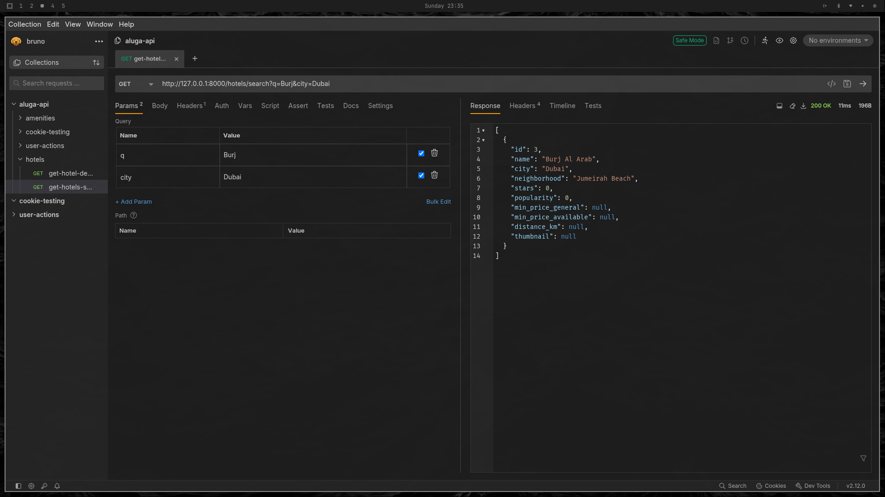
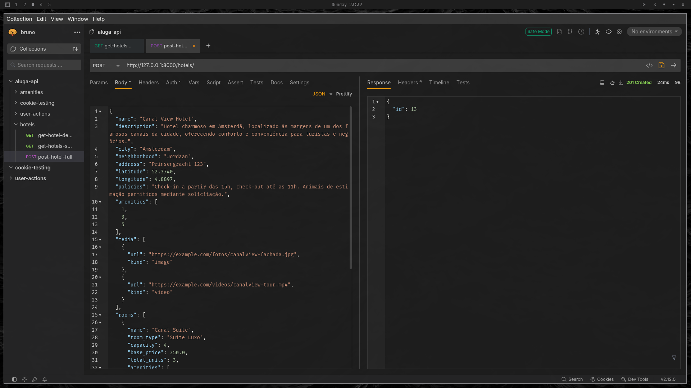
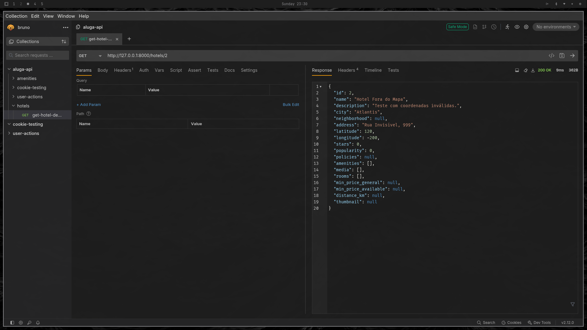
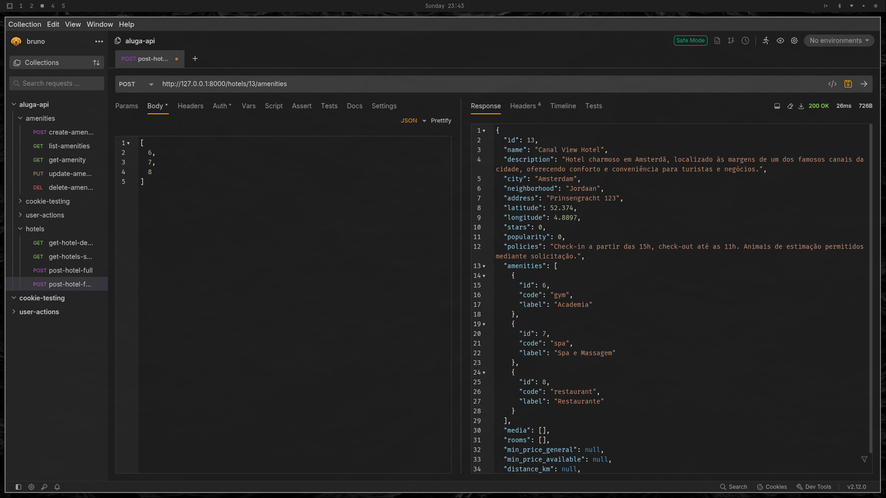
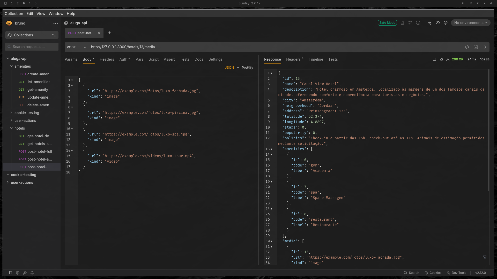
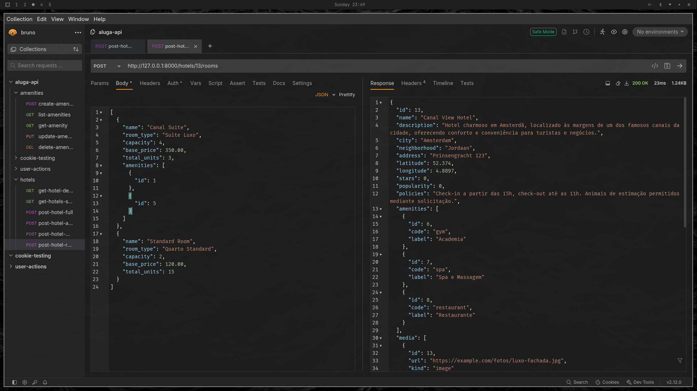

# Relatório de Testes de API & Evidências — Hotel Service

Este documento registra os testes dos principais endpoints do serviço de hotéis da API `aluga-api`, incluindo criação completa de hotéis e busca com filtros. Cada seção contém payloads, respostas de sucesso e evidências visuais.

## Visão Geral dos Testes

| **Projeto**     | `aluga-api`                         |
| --------------- | ----------------------------------- |
| **Ambiente**    | `Ambiente de desenvolvimento local` |
| **Data**        | 05/10/2025                          |
| **Ferramentas** | Curl / Bruno                       |

---

## 1. Buscar Hotéis

### Endpoint

**GET** `/hotels/search`

### Objetivo

Buscar hotéis usando múltiplos filtros e ordenação.

### Query Parameters

```text
q            (string)    → Busca textual pelo nome do hotel
city         (string)    → Cidade do hotel
neighborhood (string)    → Bairro do hotel
amenities    (List[int]) → IDs das comodidades exigidas
room_type    (string)    → Tipo de quarto exigido
price_min    (float)     → Preço mínimo desejado
price_max    (float)     → Preço máximo desejado
check_in     (date)      → Data de entrada para disponibilidade
check_out    (date)      → Data de saída para disponibilidade
stars_min    (float)     → Estrelas mínimas do hotel
stars_max    (float)     → Estrelas máximas do hotel
user_lat     (float)     → Latitude do usuário (para cálculo de distância)
user_lng     (float)     → Longitude do usuário (para cálculo de distância)
sort         (string)    → Critério de ordenação: id, price, rating, popularity, distance
page         (int)       → Página da paginação (default=1)
size         (int)       → Tamanho da página (default=20, máximo=100)
```

### Resposta de Sucesso (200 OK)

```json
[
  {
    "id": 3,
    "name": "Burj Al Arab",
    "city": "Dubai",
    "neighborhood": "Jumeirah Beach",
    "stars": 5.0,
    "popularity": 98.7,
    "min_price_general": 1500.0,
    "min_price_available": 1500.0,
    "distance_km": 2.3,
    "thumbnail": "https://example.com/fotos/burj-fachada.jpg"
  },
  {
    "id": 4,
    "name": "Hotel Lux",
    "city": "Dubai",
    "neighborhood": "Downtown",
    "stars": 4.5,
    "popularity": 87.2,
    "min_price_general": 1200.0,
    "min_price_available": 1200.0,
    "distance_km": 5.1,
    "thumbnail": "https://example.com/fotos/lux.jpg"
  }
]
```

**Evidências:**


---

## 2. Criar Hotel Completo

### Endpoint

**POST** `/hotels/full`

### Objetivo

Criar um hotel completo com informações de quartos, mídias e comodidades.

### Corpo da Requisição (`application/json`)

```json
{
  "name": "Burj Al Arab",
  "description": "Hotel icônico em Dubai, conhecido por luxo extremo e serviço cinco estrelas.",
  "city": "Dubai",
  "neighborhood": "Jumeirah Beach",
  "address": "Jumeirah St",
  "latitude": 25.1412,
  "longitude": 55.1853,
  "policies": "Check-in a partir das 15h, check-out até as 12h.",
  "amenities": [1, 2, 3],
  "media": [
    {"url": "https://example.com/fotos/burj-fachada.jpg", "kind": "image"},
    {"url": "https://example.com/videos/burj-tour.mp4", "kind": "video"}
  ],
  "rooms": [
    {
      "name": "Royal Suite",
      "room_type": "Luxo",
      "capacity": 4,
      "base_price": 5000.0,
      "total_units": 2,
      "amenities": [{"id": 1}, {"id": 2}]
    },
    {
      "name": "Deluxe Room",
      "room_type": "Luxo",
      "capacity": 2,
      "base_price": 1500.0,
      "total_units": 10,
      "amenities": [{"id": 1}]
    }
  ]
}
```

### Observações

* Valida proximidade geográfica para evitar hotéis duplicados no mesmo local.
* Retorna o `HotelDetail` completo, incluindo quartos, mídias e comodidades.

### Resposta de Sucesso (200 OK)

```json
{
  "id": 3,
  "name": "Burj Al Arab",
  "description": "Hotel icônico em Dubai, conhecido por luxo extremo e serviço cinco estrelas.",
  "city": "Dubai",
  "neighborhood": "Jumeirah Beach",
  "address": "Jumeirah St",
  "latitude": 25.1412,
  "longitude": 55.1853,
  "stars": 0.0,
  "popularity": 0.0,
  "policies": "Check-in a partir das 15h, check-out até as 12h.",
  "amenities": [
    {"id": 1, "name": "Wi-Fi"},
    {"id": 2, "name": "Piscina"}
  ],
  "media": [
    {"url": "https://example.com/fotos/burj-fachada.jpg", "kind": "image"},
    {"url": "https://example.com/videos/burj-tour.mp4", "kind": "video"}
  ],
  "rooms": [
    {
      "name": "Royal Suite",
      "room_type": "Luxo",
      "capacity": 4,
      "base_price": 5000.0,
      "total_units": 2,
      "amenities": [{"id": 1}, {"id": 2}]
    }
  ],
  "min_price_general": 1500.0,
  "min_price_available": 1500.0,
  "distance_km": null,
  "thumbnail": "https://example.com/fotos/burj-fachada.jpg"
}
```

**Evidências:**


---

## 3. Detalhes do Hotel

### Endpoint

**GET** `/hotels/{hotel_id}`

### Objetivo

Consultar informações completas de um hotel.

### Parâmetros

* **Rota:** `hotel_id` (int) — ID do hotel
* **Query (opcional):** `check_in` (date), `check_out` (date), `user_lat` (float), `user_lng` (float)

### Resposta de Sucesso (200 OK)

```json
{
  "id": 1,
  "name": "Hotel Pôr do Sol",
  "description": "Hotel aconchegante com vista para o mar.",
  "city": "Rio de Janeiro",
  "neighborhood": "Copacabana",
  "address": "Av. Atlântica, 1234",
  "latitude": -22.971177,
  "longitude": -43.182543,
  "stars": 4.5,
  "popularity": 87.3,
  "policies": "Check-in 14h, check-out 12h.",
  "amenities": [{"id": 1, "name": "Wi-Fi"}, {"id": 2, "name": "Piscina"}],
  "media": [{"id": 1, "url": "https://cdn.exemplo.com/hotel1/fachada.jpg"}],
  "rooms": [{"id": 101, "name": "Quarto Standard", "capacity": 2, "price": 250.0}],
  "min_price_general": 250.0,
  "min_price_available": 350.0,
  "distance_km": 1.2,
  "thumbnail": "https://cdn.exemplo.com/hotel1/thumb.jpg"
}
```

### Observações

* `min_price_general`: menor preço entre todos os quartos
* `min_price_available`: menor preço disponível no período informado
* `distance_km`: calculado se `user_lat` e `user_lng` fornecidos
* `thumbnail`: primeira mídia do hotel

**Evidência:**


---

## 4. Hotéis x Comodidades

### Endpoint

**POST** `/hotels/{hotel_id}/amenities`

### Objetivo

Associar comodidades existentes a um hotel.

### Parâmetros

* **Rota:** `hotel_id` (int) — ID do hotel
* **Corpo (`application/json`):** lista de IDs de comodidades

```json
[1, 2, 3]
```

### Resposta de Sucesso (200 OK)

```json
{
  "id": 1,
  "name": "Hotel Pôr do Sol",
  "amenities": [
    { "id": 1, "code": "WIFI", "label": "Wi-Fi" },
    { "id": 2, "code": "POOL", "label": "Piscina" },
    { "id": 3, "code": "GYM", "label": "Academia" }
  ],
  "rooms": [
    {
      "id": 1,
      "name": "Quarto Luxo",
      "room_type": "Luxo",
      "capacity": 2,
      "base_price": 420.0,
      "total_units": 3,
      "amenities": []
    }
  ],
  "media": [],
  "min_price_available": null,
  "min_price_general": null,
  "stars": 0.0,
  "popularity": 0.0,
  "thumbnail": null
}
```

**Evidência:**


---

## 5. Hotéis x Mídias

### Endpoint

**POST** `/hotels/{hotel_id}/media`

### Objetivo

Adicionar mídias (imagens ou vídeos) a um hotel existente.

### Parâmetros

* **Rota:** `hotel_id` (int) — ID do hotel
* **Corpo (`application/json`):**

```json
[
  {"url": "https://example.com/fotos/fachada.jpg", "kind": "image"},
  {"url": "https://example.com/fotos/lobby.jpg", "kind": "image"},
  {"url": "https://example.com/videos/tour.mp4", "kind": "video"},
  {"url": "https://example.com/fotos/piscina.jpg"}
]
```

### Observações

* `kind` é opcional; se não informado, será `"default"`
* Retorna o `HotelDetail` atualizado com todas as mídias existentes e recém-adicionadas

### Resposta de Sucesso (200 OK)

```json
{
  "id": 1,
  "name": "Hotel Pôr do Sol",
  "description": "Hotel aconchegante com vista para o mar e café da manhã incluso.",
  "city": "Rio de Janeiro",
  "neighborhood": null,
  "address": "Av. Atlântica, 1234 - Copacabana",
  "latitude": -22.971177,
  "longitude": -43.182543,
  "stars": 0.0,
  "popularity": 0.0,
  "policies": null,
  "amenities": [],
  "media": [
    {"id": 1, "url": "https://example.com/fotos/fachada.jpg", "kind": "image"},
    {"id": 2, "url": "https://example.com/fotos/lobby.jpg", "kind": "image"},
    {"id": 3, "url": "https://example.com/videos/tour.mp4", "kind": "video"},
    {"id": 4, "url": "https://example.com/fotos/piscina.jpg", "kind": "default"}
  ],
  "rooms": [
    {"id": 1, "name": "Quarto Luxo", "room_type": "Luxo", "capacity": 2, "base_price": 420.0, "total_units": 3, "amenities": []},
    {"id": 2, "name": "Quarto Econômico", "room_type": "Econômico", "capacity": 2, "base_price": 250.0, "total_units": 5, "amenities": []}
  ],
  "min_price_general": null,
  "min_price_available": null,
  "distance_km": null,
  "thumbnail": null
}
```

**Evidência:**


---

## 6. Hotéis x Quartos

### Endpoint

**POST** `/hotels/{hotel_id}/rooms`

### Objetivo

Adicionar múltiplos quartos a um hotel existente.

### Parâmetros

* **Rota:** `hotel_id` (int) — ID do hotel
* **Corpo (`application/json`):**

```json
[
  {
    "name": "Quarto Luxo",
    "room_type": "Luxo",
    "capacity": 2,
    "base_price": 420.00,
    "total_units": 3
  },
  {
    "name": "Quarto Econômico",
    "room_type": "Econômico",
    "capacity": 2,
    "base_price": 250.00,
    "total_units": 5
  }
]
```

### Observações

* `amenities` é opcional; se não informado, será inicializado como lista vazia
* Retorna o `HotelDetail` atualizado com todos os quartos existentes e recém-adicionados

### Resposta de Sucesso (200 OK)

```json
{
  "id": 1,
  "name": "Hotel Pôr do Sol",
  "description": "Hotel aconchegante com vista para o mar e café da manhã incluso.",
  "city": "Rio de Janeiro",
  "neighborhood": null,
  "address": "Av. Atlântica, 1234 - Copacabana",
  "latitude": -22.971177,
  "longitude": -43.182543,
  "stars": 0.0,
  "popularity": 0.0,
  "policies": null,
  "amenities": [],
  "media": [],
  "rooms": [
    {
      "id": 1,
      "name": "Quarto Luxo",
      "room_type": "Luxo",
      "capacity": 2,
      "base_price": 420.0,
      "total_units": 3,
      "amenities": []
    },
    {
      "id": 2,
      "name": "Quarto Econômico",
      "room_type": "Econômico",
      "capacity": 2,
      "base_price": 250.0,
      "total_units": 5,
      "amenities": []
    }
  ],
  "min_price_general": null,
  "min_price_available": null,
  "distance_km": null,
  "thumbnail": null
}
```

**Evidência:**

