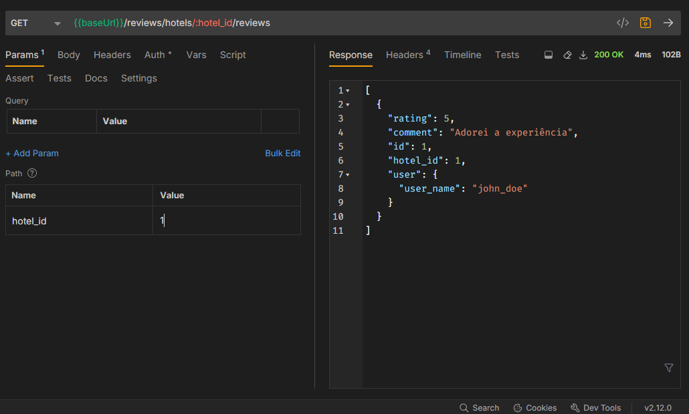
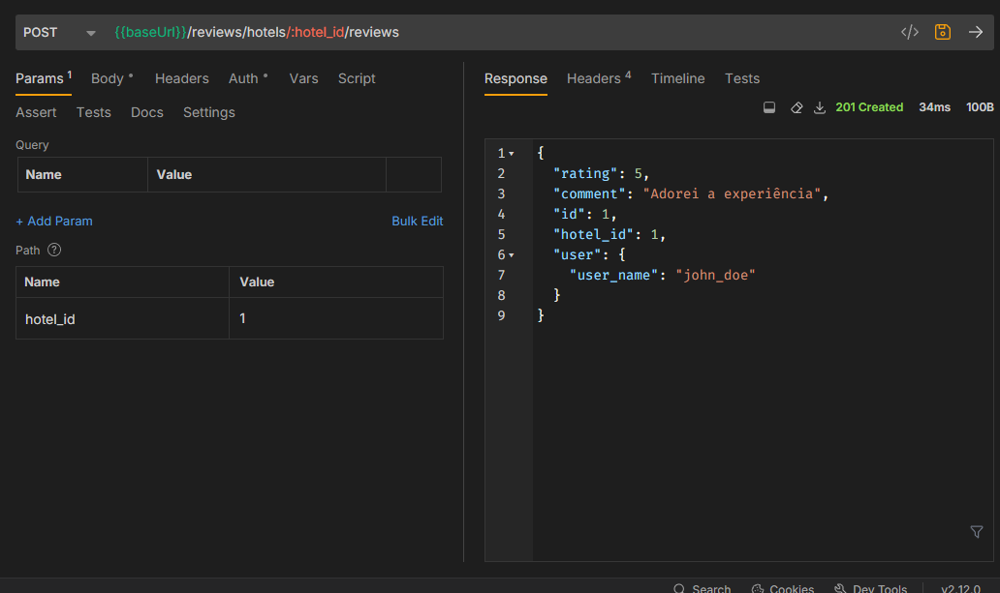
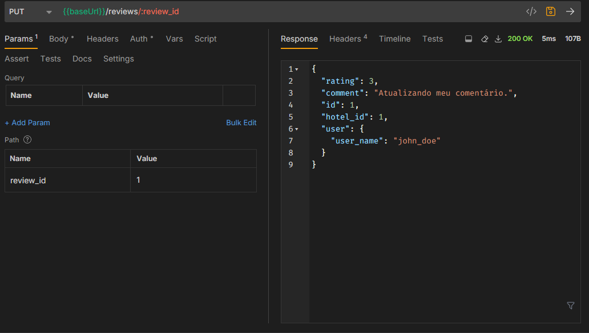
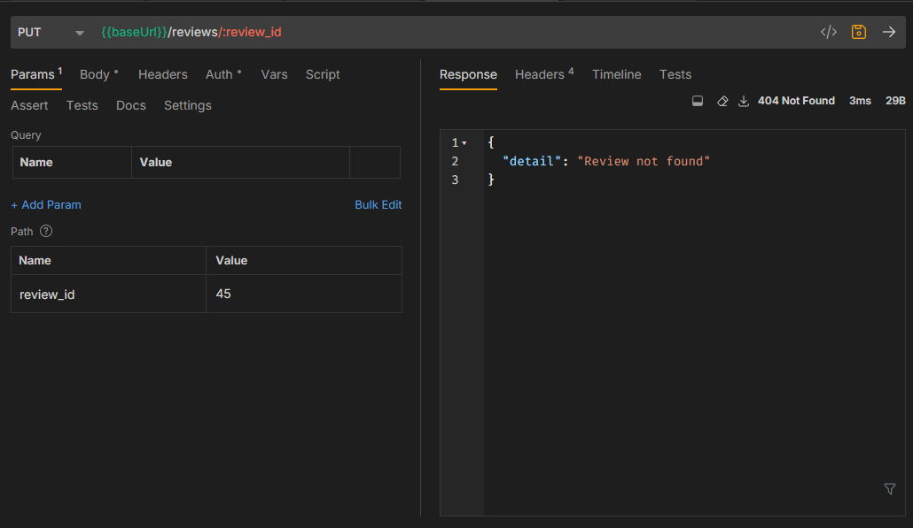
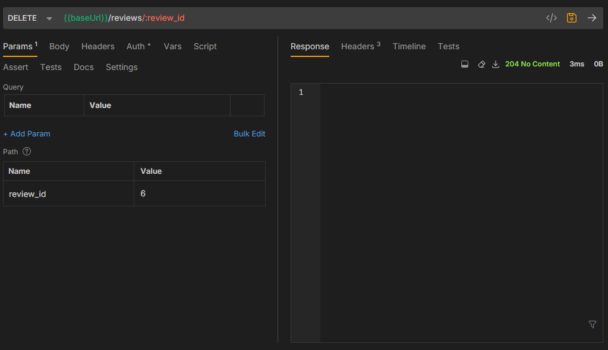
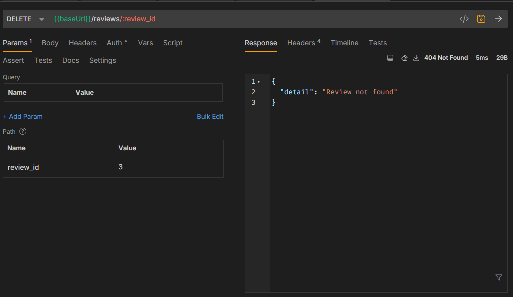

# ✅ API Test Report & Evidence

This document serves as a record of API tests performed, the endpoints tested, expected and actual results, and any supporting evidence such as payloads, responses, and screenshots (if applicable).

---

## 🧪 Test Overview

| Field              | Value                                  |
|--------------------|----------------------------------------|
| **Project**        | `aluga-api`                    |
| **Environment**    | `Development`     |
| **Tester**         | `Gustavo Rossetti`                            |
| **Date**           | `2025-10-04`                           |
| **Tool Used**      | Bruno / Swagger UI / etc.     |
| **Test Status**    | ✅ Passed / ❌ Failed / ⚠️ Partial       |

---

## 🔁 Test Cases

### Endpoint Avaliações

- **Método:** `GET`
- **URL:** `/hotels/{hotel_id}/reviews`
- Parâmetros: hotel_id: O ID do hotel que você deseja consultar. 
#### Respostas:
> **Sucesso (`200 OK`)**
>
> ```json
> {
>   "message": "Success",
>   "data": [
>     {
>       "rating": 5,
>       "comment": "adorei a experiência!",
>       "id": 1,
>       "hotel_id": 1,
>       "user": {
>         "user_name": "john_doe"
>       }
>     }
>   ]
> }
> ```
Evidências:



---
- **Método:** `POST`
- **URL:** `/hotels/{hotel_id}/reviews`
- Parâmetros: hotel_id: O ID do hotel a ser avaliado. Request Body (JSON): Um objeto contendo a nota e o comentário.
  ```json
  {
      "rating": 5,
      "comment": "Adorei a experiência!"
  }
> **Sucesso (`201 Created`)**
>
> ```json
> {
>   "message": "Success",
>   "data": {
>     "rating": 5,
>     "comment": "Adorei a experiência!",
>     "id": 2,
>     "hotel_id": 1,
>     "user": {
>       "user_name": "john_doe"
>     }
>   }
> }
> ```
Evidências:



- **Método:** `PUT`
- **URL:** `/reviews/{review_id}`
- Parâmetros: review_id : O ID da avaliação que você deseja modificar. Request Body (JSON): Um objeto com os campos a serem atualizados
  ```json
  {
      "rating": 3,
      "comment": "Atualizando meu comentário."
  }
> **Sucesso (`200 OK`)**
>
> ```json
> {
>   "message": "Success",
>   "data": {
>     "rating": 3,
>     "comment": "Atualizando meu comentário.",
>     "id": 2,
>     "hotel_id": 1,
>     "user": {
>       "user_name": "john_doe"
>     }
>   }
> }

Evidências:




> **Erro (`404 Not Found`)**
>
> ```json
> {
>   "message": "Error",
>   "data": {
>     "detail": "Review not found"
>   }
> }

Evidências:



> ```
- **Método:** `DELETE`
- **URL:** `/reviews/{review_id}`
Parâmetros: review_id: O ID da avaliação a ser deletada.
#### Respostas:
> **Sucesso (`204 No Content`)**
>Evidências:



> **Erro (`404 Not Found`)**
>
> ```json
> {
>   "message": "Error",
>   "data": {
>     "detail": "Review not found"
>   }
> }
> ```
Evidências:


