# ✅ API Test Report & Evidence

This document serves as a record of API tests performed, the endpoints tested, expected and actual results, and any supporting evidence such as payloads, responses, and screenshots (if applicable).

---

## 🧪 Test Overview

| Field              | Value                                  |
|--------------------|----------------------------------------|
| **Project**        | `aluga-api`                    |
| **Environment**    | `Development`     |
| **Tester**         | `Luiz Andrade`                            |
| **Date**           | `2025-10-03`                           |
| **Tool Used**      | Bruno / Curl / Swagger UI / etc.     |
| **Test Status**    | ✅ Passed / ❌ Failed / ⚠️ Partial       |

---

## 🔁 Test Cases

### 1. `GET /users/`

**Purpose**: Retrieve all users with a SysAdmin login.

- **Request**
  - **Method**: `GET`
  - **URL**: `/users/`
  - **Headers**: `Authorization: Bearer <token>` or `credentials: include <cookie>`
  
- **Expected Result**: HTTP `200 OK` with a list of users.
- **Actual Result**: ✅ `200 OK`
- **Response Body**:
  ```json
  [
    {
      "id": "user_123",
      "userName": "john_doe",
      "emailAddress": "john@example.com"
    }
    [...]
  ]
- Evidences:


### 2. `GET /users/`

**Purpose**: Fail to retrieve all users without a SysAdmin login.

- **Request**
  - **Method**: `GET`
  - **URL**: `/users/`
  - **Headers**: `Authorization: Bearer <token>` or `credentials: include <cookie>`
  
- **Expected Result**: HTTP `401 Unauthorized` with a list of users.
- **Actual Result**: ✅ `401 Unauthorized`
- **Response Body**:
  
  if logged in without required permission
  ```json
  {
    "detail": "Only admins"
  }
  ```
  if no logged in
  ```json
  {
    "detail": "No authentication data found, please authenticate"
  }
  ```
- Evidences:

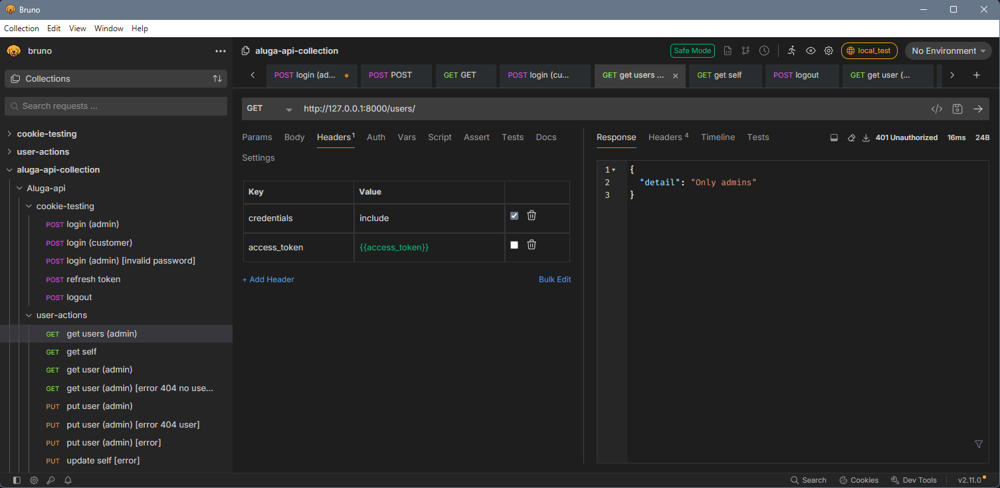
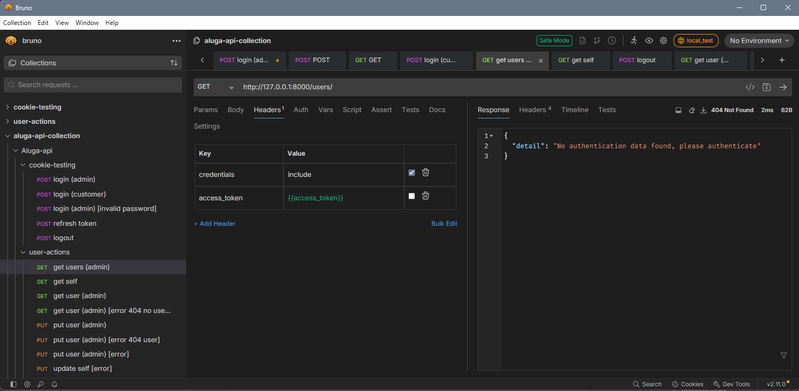
---

### 3. `GET /users/me`

**Purpose**: Get information about self (as in logged in user).

- **Request**
  - **Method**: `GET`
  - **URL**: `/users/me`
  - **Headers**: `Authorization: Bearer <token>` or `credentials: include <cookie>`
  
- **Expected Result**: HTTP `200 OK` with a list of users.
- **Actual Result**: ✅ `200 OK`
- **Response Body**:
  
  ```json
  {
    "id": "b64c8392-50c1-4dbe-89c5-4a5ad3b6d06b",
    "userName": "john_doe",
    "password": "Secure123!",
    "role": "customer",
    "birthDate": "1990-06-15T00:00:00",
    "emailAddress": "john.doe@example.com",
    "phoneNumber": "+1-123-456-7890",
    "firstName": "John",
    "lastName": "Doe",
    "address": "123 Main St, Springfield, IL 62704"
  }
- Evidences:
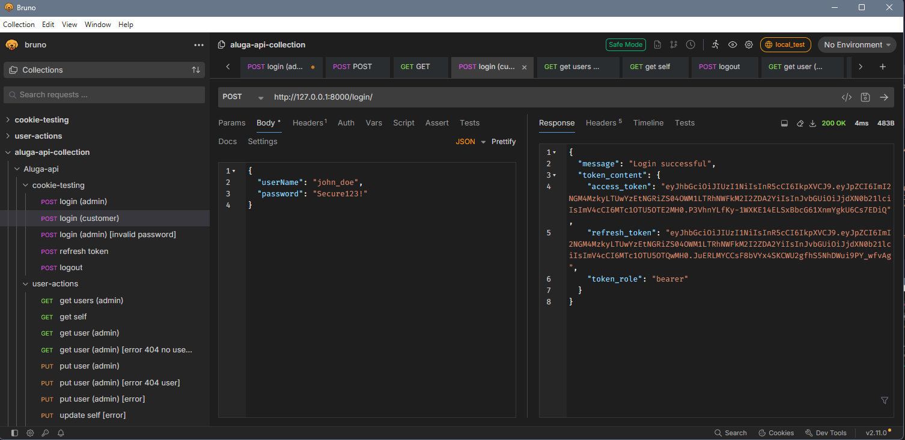
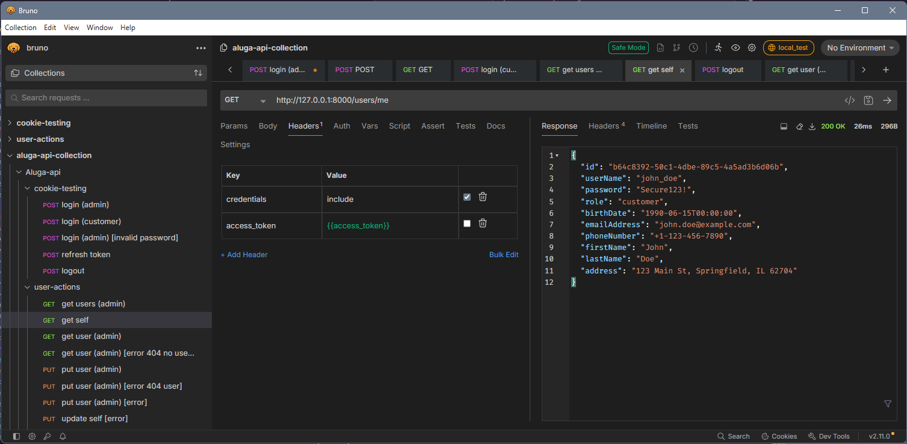

### 4. `GET /users/me`

**Purpose**: Get information about self (as in logged in user) while not logged in.

- **Request**
  - **Method**: `GET`
  - **URL**: `/users/me`
  - **Headers**: `Authorization: Bearer <token>` or `credentials: include <cookie>`
  
- **Expected Result**: HTTP `404 Not Found` with No authentication data found, please authenticate.
- **Actual Result**: ✅ `404 Not Found`
- **Response Body**:
  
  ```json
  {
    "detail": "No authentication data found, please authenticate"
  }
- Evidences:
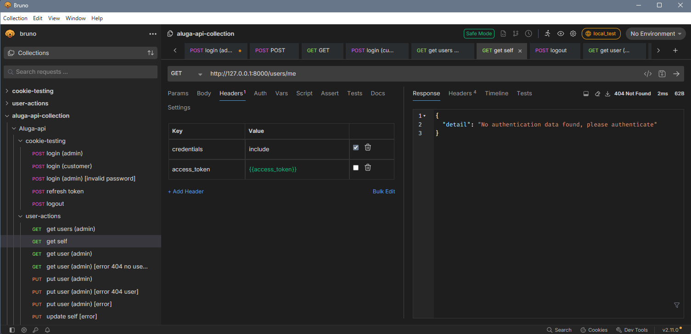

---

### 5. `GET /users/{username}`

**Purpose**: Retrieve a certain user with a SysAdmin login.

- **Request**
  - **Method**: `GET`
  - **URL**: `/users/{username}`
  - **Headers**: `Authorization: Bearer <token>` or `credentials: include <cookie>`
  
- **Expected Result**: HTTP `200 OK` with No authentication data found, please authenticate.
- **Actual Result**: ✅ `200 OK`
- **Response Body**:
  
  ```json
  {
    "id": "fa51299a-bb30-4e3d-9fc3-3f64728a6b64",
    "userName": "maria_lee",
    "password": "Admin!234",
    "role": "sysAdmin",
    "birthDate": "1985-09-10T00:00:00",
    "emailAddress": "maria.lee@example.com",
    "phoneNumber": "+1-234-567-8901",
    "firstName": "Maria",
    "lastName": "Lee",
    "address": "456 Oak Ave, Chicago, IL 60616"
  }
- Evidences:
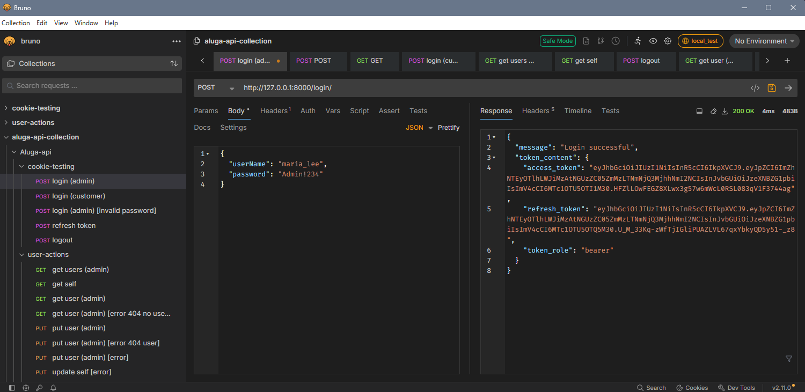
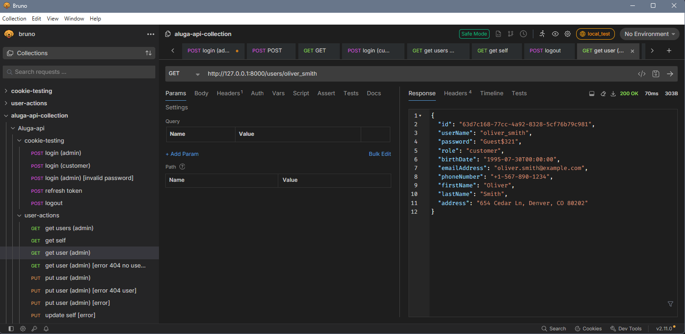

### 6. `GET /users/{username}`

**Purpose**: Fail to retrieve a certain user without a SysAdmin login.

- **Request**
  - **Method**: `GET`
  - **URL**: `/users/{username}`
  - **Headers**: `Authorization: Bearer <token>` or `credentials: include <cookie>`
  
- **Expected Result**: HTTP `404 Not Found` with No authentication data found, please authenticate.
- **Actual Result**: ✅ `404 Not Found`
- **Response Body**:
  
  if logged in without required permission
  ```json
  {
    "detail": "Only admins"
  }
  ```
  if no logged in
  ```json
  {
    "detail": "No authentication data found, please authenticate"
  }
  ```
- Evidences:
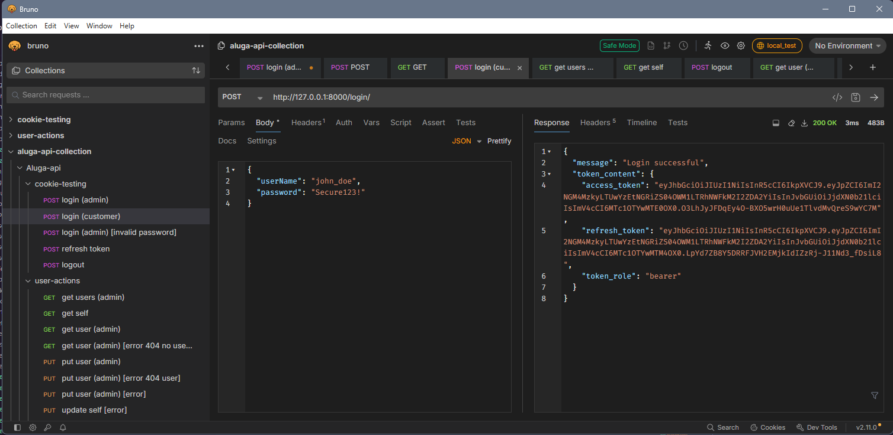
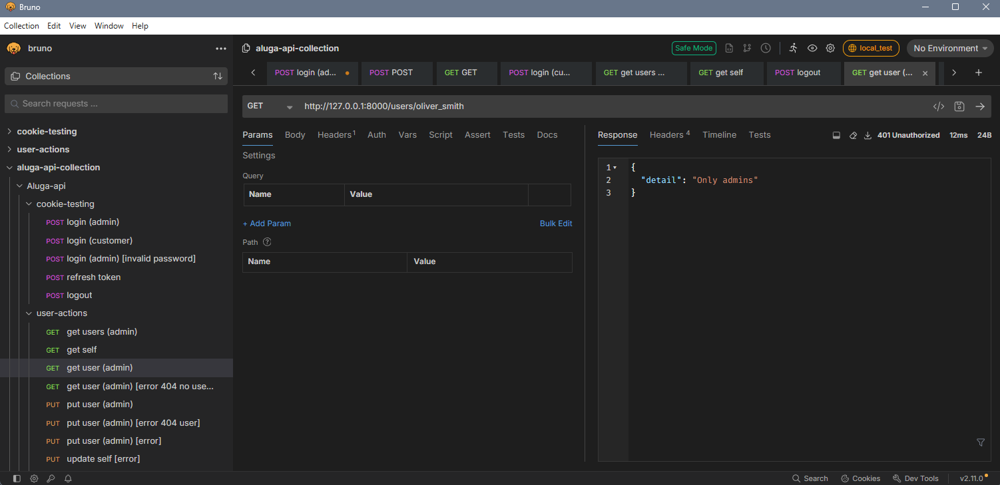
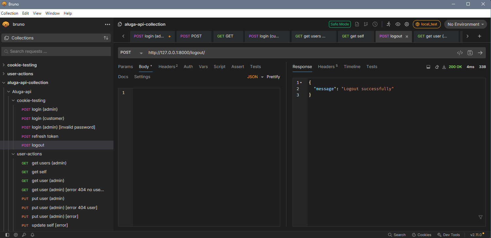
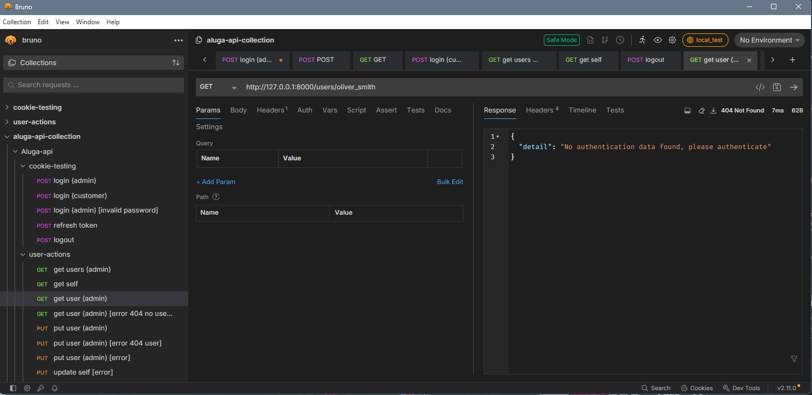

### 7. `GET /users/{username}`

**Purpose**: Fail to retrieve a certain user because it doesn't exist.

- **Request**
  - **Method**: `GET`
  - **URL**: `/users/{username}`
  - **Headers**: `Authorization: Bearer <token>` or `credentials: include <cookie>`
  
- **Expected Result**: HTTP `404 Not Found` with No authentication data found, please authenticate.
- **Actual Result**: ✅ `404 Not Found`
- **Response Body**:
  
  if logged in without required permission
  ```json
  {
    "detail": "User not found"
  }
  ```
- Evidences:
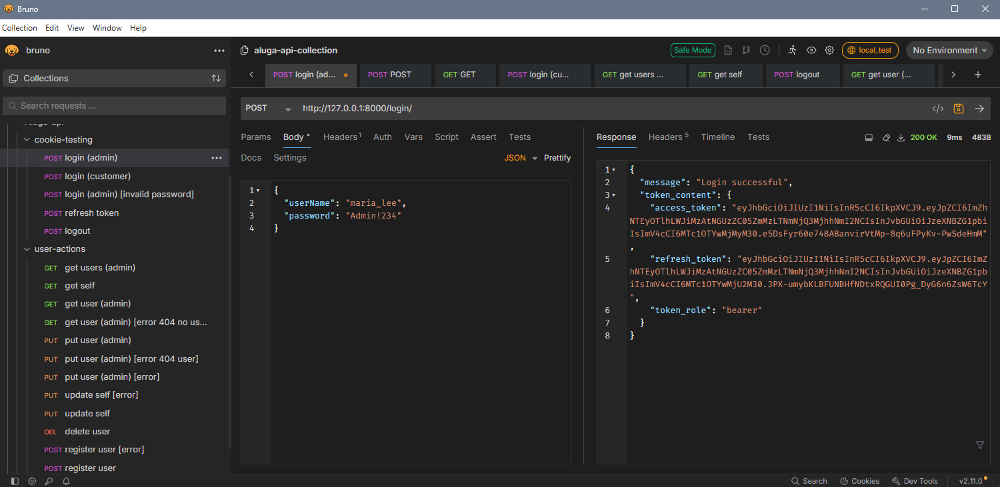

---

### 8. `PUT /users/{username}`

**Purpose**: Update a certain user using a SysAdmin login.

- **Request**
  - **Method**: `PUT`
  - **URL**: `/users/{username}`
  - **Headers**: `Authorization: Bearer <token>` or `credentials: include <cookie>`
  
- **Expected Result**: HTTP `200 OK` with No authentication data found, please authenticate.
- **Actual Result**: ✅ `200 OK`
- **Response Body**:
  
  ```json
  {
    "id": "0f2bbbe3-236d-4d83-a502-12a4ad1d219d",
    "userName": "emily_nguyen",
    "password": "Employee789@",
    "role": "customer",
    "birthDate": "1992-11-05T00:00:00",
    "emailAddress": "admin.db_insertion1db_insertion1.nguyen@example.com",
    "phoneNumber": "81981815338",
    "firstName": "Emily",
    "lastName": "Nguyen",
    "address": "322 Birch Rd, Austin, TX 73301"
  }
  ```
- Evidences:
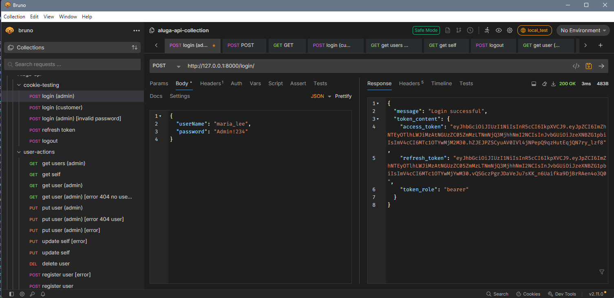
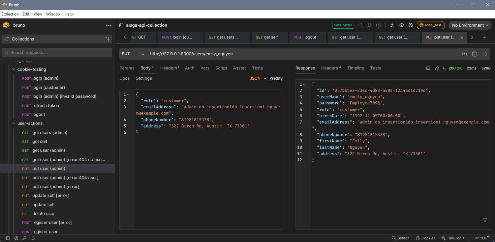

### 9. `PUT /users/{username}`

**Purpose**: Fail to update a certain user.

- **Request**
  - **Method**: `PUT`
  - **URL**: `/users/{username}`
  - **Headers**: `Authorization: Bearer <token>` or `credentials: include <cookie>`
 --- 
- **Expected Result**: HTTP `401 Unauthorized` with No authentication data found, please authenticate.
- **Expected Result**: HTTP `404 Not Found` with No authentication data found, please authenticate.
- **Expected Result**: HTTP `422 Unprocessable Entity` with No authentication data found, please authenticate.
---
- **Actual Result**: ✅ `401 Unauthorized`
- **Actual Result**: ✅ `404 Not Found`
- **Actual Result**: ✅ `422 Unprocessable Entity`
---
- **Response Body**:

  if logged in and no permission
  ```json
  {
    "detail": "Only admins"
  }
  ```
  if logged out
  ```json
  {
    "detail": "No authentication data found, please authenticate"
  }
  ```
  if certain field isn't updateable
  ```json
  {
    "detail": "Some fields cannot be updated with such role: ['firstName']"
  }
  ```
- Evidences:
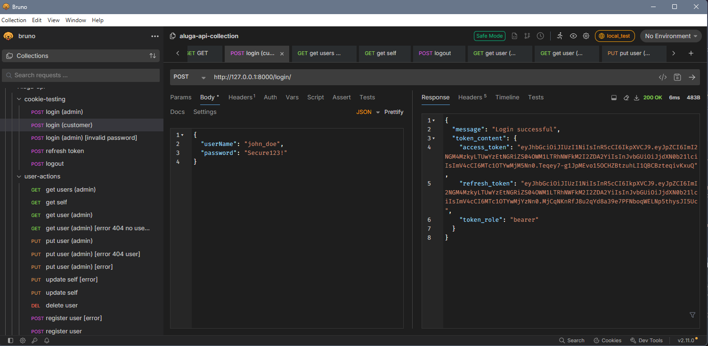
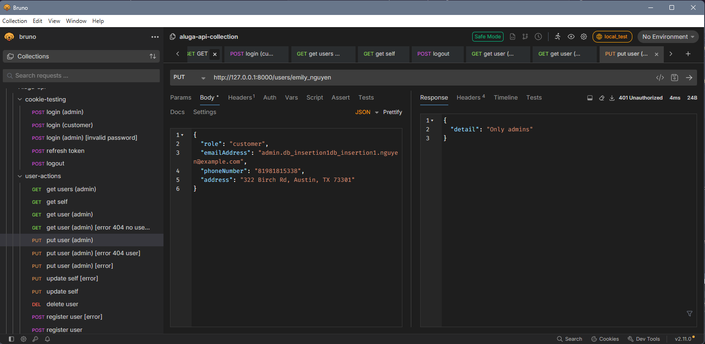
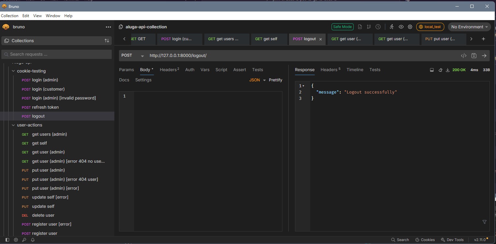
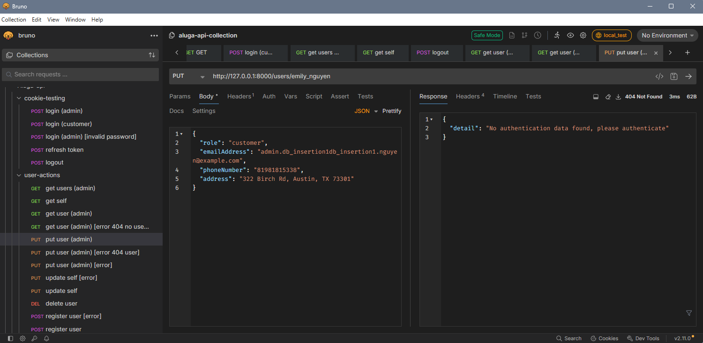

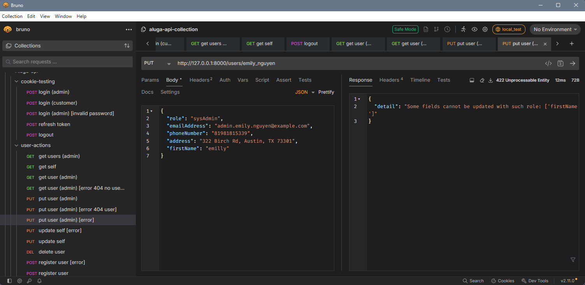


### 10. `PUT /users/{username}`

**Purpose**: Fail to update a certain user because a field validation failed.

- **Request**
  - **Method**: `PUT`
  - **URL**: `/users/{username}`
  - **Headers**: `Authorization: Bearer <token>` or `credentials: include <cookie>`
 --- 
- **Expected Result**: HTTP `422 Unprocessable Entity` with No authentication data found, please authenticate.
---
- **Actual Result**: ✅ `422 Unprocessable Entity`
---
- **Response Body**:

  ```json
  {
    "detail": [
      {
        "type": "string_pattern_mismatch",
        "loc": [
          "emailAddress"
        ],
        "msg": "String should match pattern '^[a-zA-Z0-9._%+-]+@[a-zA-Z0-9.-]+\\.[a-zA-Z]{2,}$'",
        "input": "emily1.nguyenexample.com",
        "ctx": {
          "pattern": "^[a-zA-Z0-9._%+-]+@[a-zA-Z0-9.-]+\\.[a-zA-Z]{2,}$"
        },
        "url": "https://errors.pydantic.dev/2.11/v/string_pattern_mismatch"
      },
      {
        "type": "string_pattern_mismatch",
        "loc": [
          "phoneNumber"
        ],
        "msg": "String should match pattern '^\\s*(?:\\+?(\\d{1,3}))?[-. (]*(\\d{3})[-. )]*(\\d{3})[-. ]*(\\d{4})(: *x(\\d+))?\\s*$'",
        "input": "8245453451981815339",
        "ctx": {
          "pattern": "^\\s*(?:\\+?(\\d{1,3}))?[-. (]*(\\d{3})[-. )]*(\\d{3})[-. ]*(\\d{4})(: *x(\\d+))?\\s*$"
        },
        "url": "https://errors.pydantic.dev/2.11/v/string_pattern_mismatch"
      }
    ]
  }
  ```
- Evidences:

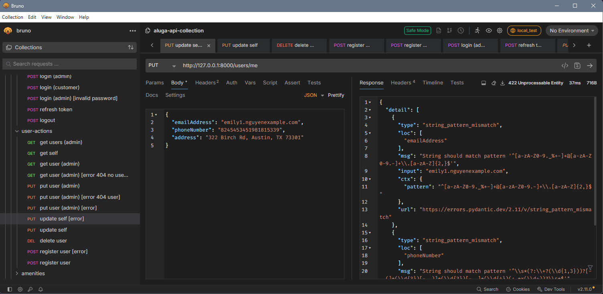
---

### 11.`PUT /users/me`

**Purpose**: Update self (as in used logged in).

- **Request**
  - **Method**: `PUT`
  - **URL**: `/users/me`
  - **Headers**: `Authorization: Bearer <token>` or `credentials: include <cookie>`
 --- 
- **Expected Result**: HTTP `200 OK` with No authentication data found, please authenticate.authenticate.
---
- **Actual Result**: ✅ `200 OK`
---
- **Response Body**:

  ```json
  {
    "id": "b64c8392-50c1-4dbe-89c5-4a5ad3b6d06b",
    "userName": "john_doe",
    "password": "Secure123!",
    "role": "customer",
    "birthDate": "1990-06-15T00:00:00",
    "emailAddress": "emily1.nguyen@example.com",
    "phoneNumber": "81981815339",
    "firstName": "John",
    "lastName": "Doe",
    "address": "322 Birch Rd, Austin, TX 73301"
  }
  ```
- Evidences:
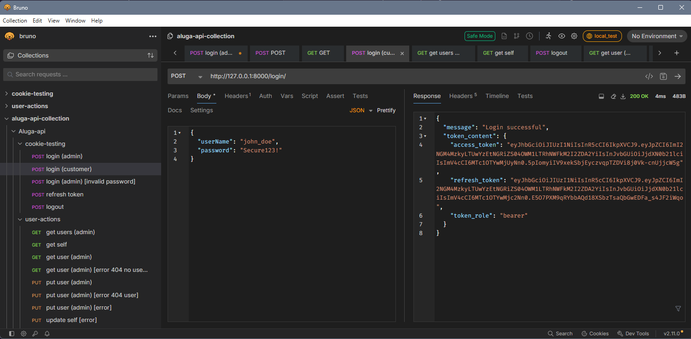
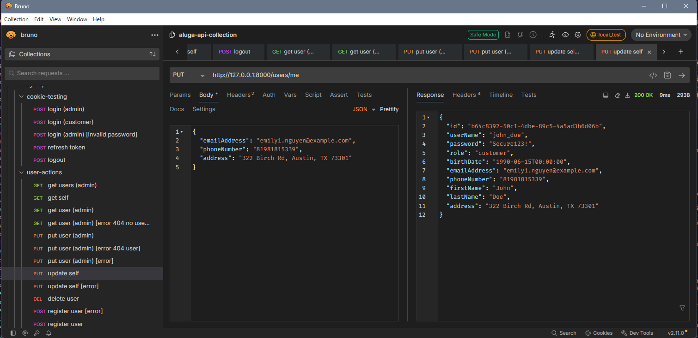

### 12.`PUT /users/me`

**Purpose**: Fail to update a certain user because a field validation failed.

- **Request**
  - **Method**: `PUT`
  - **URL**: `/users/{username}`
  - **Headers**: `Authorization: Bearer <token>` or `credentials: include <cookie>`
 --- 
- **Expected Result**: HTTP `422 Unprocessable Entity` with No authentication data found, please authenticate.
---
- **Actual Result**: ✅ `422 Unprocessable Entity`
---
- **Response Body**:

  ```json
  {
    "detail": [
      {
        "type": "string_pattern_mismatch",
        "loc": [
          "emailAddress"
        ],
        "msg": "String should match pattern '^[a-zA-Z0-9._%+-]+@[a-zA-Z0-9.-]+\\.[a-zA-Z]{2,}$'",
        "input": "emily1.nguyenexample.com",
        "ctx": {
          "pattern": "^[a-zA-Z0-9._%+-]+@[a-zA-Z0-9.-]+\\.[a-zA-Z]{2,}$"
        },
        "url": "https://errors.pydantic.dev/2.11/v/string_pattern_mismatch"
      },
      {
        "type": "string_pattern_mismatch",
        "loc": [
          "phoneNumber"
        ],
        "msg": "String should match pattern '^\\s*(?:\\+?(\\d{1,3}))?[-. (]*(\\d{3})[-. )]*(\\d{3})[-. ]*(\\d{4})(: *x(\\d+))?\\s*$'",
        "input": "8245453451981815339",
        "ctx": {
          "pattern": "^\\s*(?:\\+?(\\d{1,3}))?[-. (]*(\\d{3})[-. )]*(\\d{3})[-. ]*(\\d{4})(: *x(\\d+))?\\s*$"
        },
        "url": "https://errors.pydantic.dev/2.11/v/string_pattern_mismatch"
      }
    ]
  }
  ```
  - Evidences:
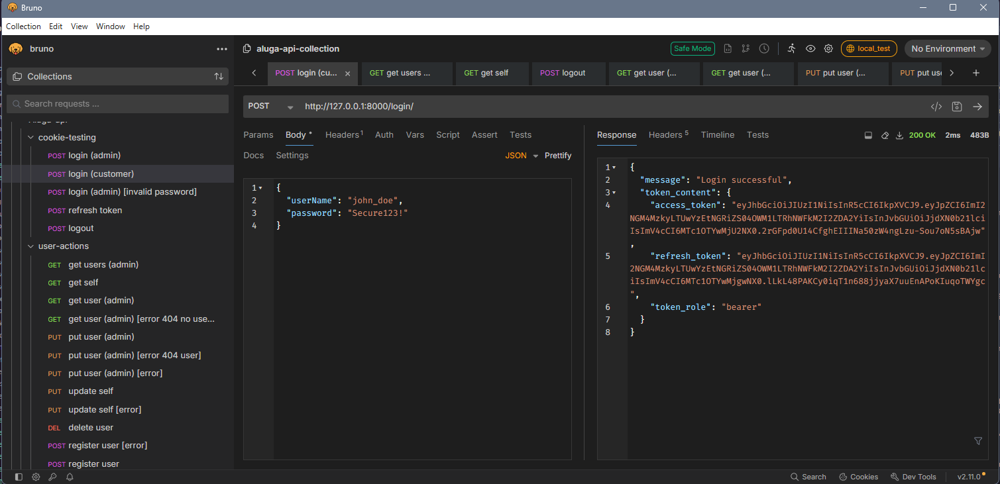
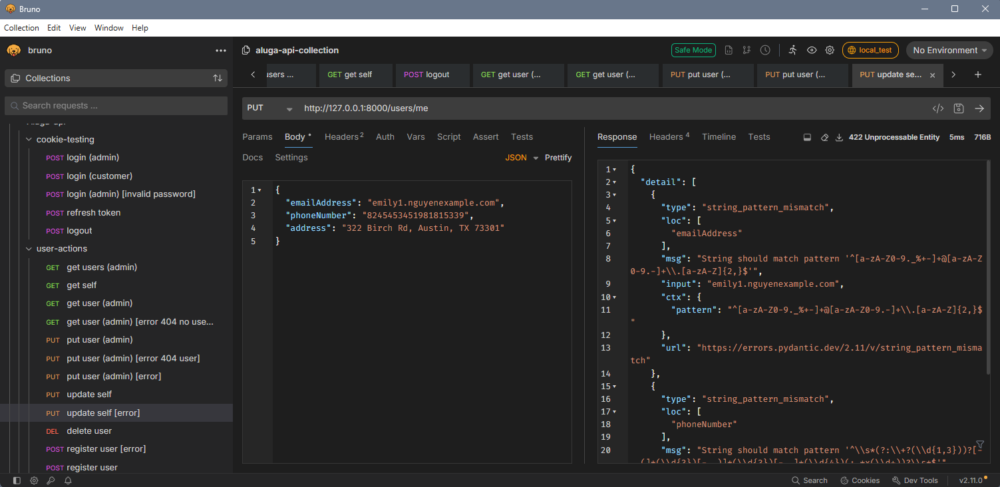
---

### 13. `DELETE /users/{username}`
**Purpose**: Delete a certain user.

- **Request**
  - **Method**: `DELETE`
  - **URL**: `/users/{username}`
  - **Headers**: `Authorization: Bearer <token>` or `credentials: include <cookie>`
 --- 
- **Expected Result**: HTTP `200 OK` with No authentication data found, please authenticate.
---
- **Actual Result**: ✅ `200 OK`
---
- **Response Body**:

  ```json
  {
    "message": "emily_nguyen deleted successfully"
  }
  ```
  - Evidences:
  
  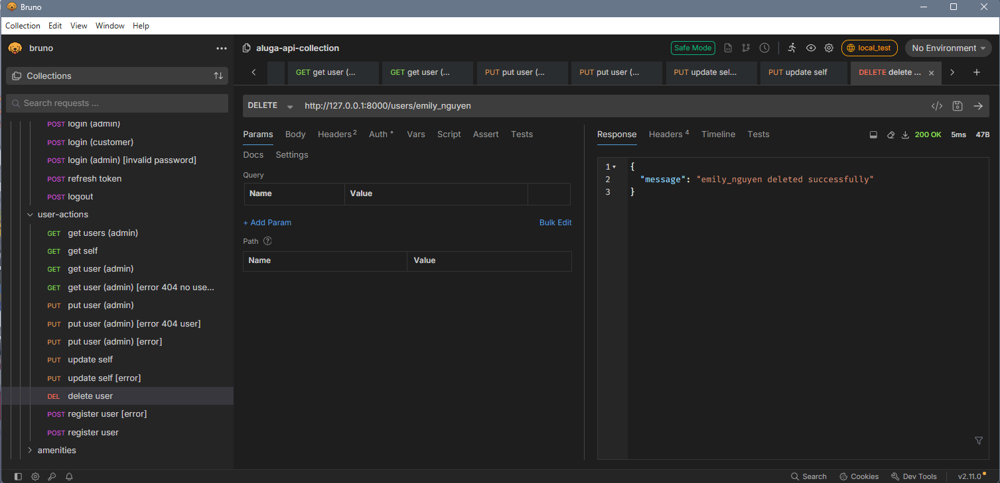

### 14. `DELETE /users/{username}`
**Purpose**: Fail to delete a certain user.

- **Request**
  - **Method**: `DELETE`
  - **URL**: `/users/{username}`
  - **Headers**: `Authorization: Bearer <token>` or `credentials: include <cookie>`
 --- 
- **Expected Result**: HTTP `401 Unauthorized` with No authentication data found, please authenticate.
- **Expected Result**: HTTP `404 Not Found` with No authentication data found, please authenticate.
---
- **Actual Result**: ✅ `401 Unauthorized`
- **Actual Result**: ✅ `404 Not Found`
---
- **Response Body**:

  ```json
  {
    "detail": "Only admins"
  }
  ```
  ```json
  {
    "detail": "User not found"
  }
  ```
  - Evidences:
  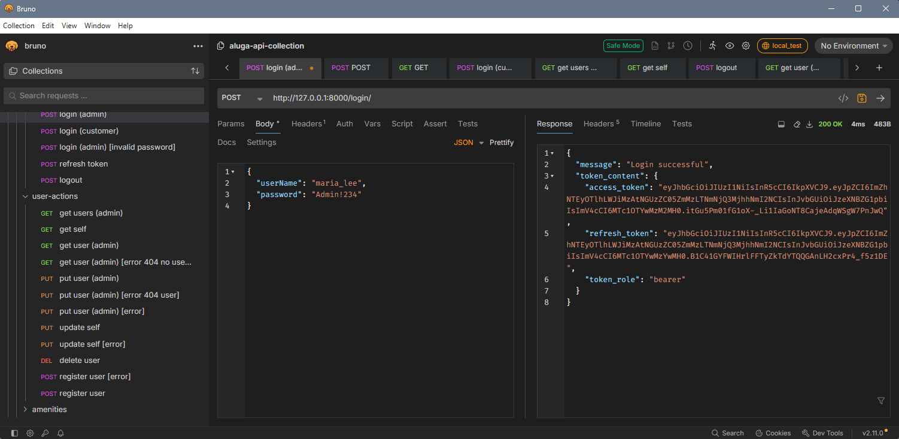
  
  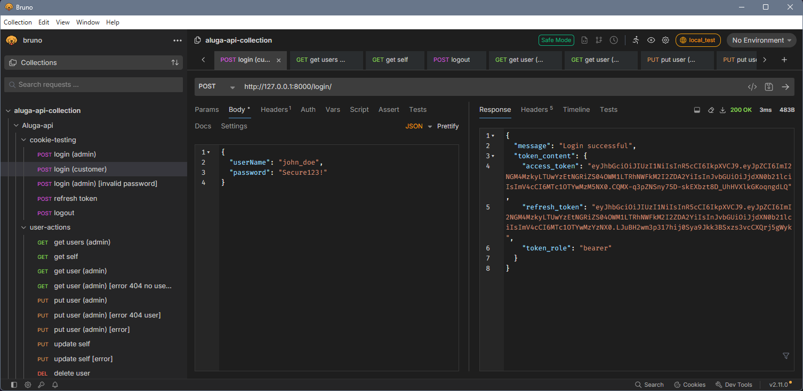
  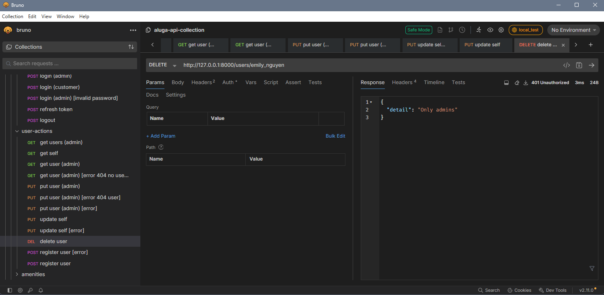
---

### 15. `POST /users/`
**Purpose**: Register a new user.

- **Request**
  - **Method**: `POST`
  - **URL**: `/users/`
 --- 
- **Expected Result**: HTTP `200 OK` with No authentication data found, please authenticate.
---
- **Actual Result**: ✅ `200 OK`
---
- **Response Body**:

  ```json
  {
    "id": "ce9d609a-92a4-492c-8399-ad5f00585cd5",
    "userName": "db_insertion1",
    "password": "Secure123!",
    "role": "sysAdmin",
    "birthDate": "1990-06-15T00:00:00",
    "emailAddress": "db_insertion_test@example.com",
    "phoneNumber": "+1-123-456-7890",
    "firstName": "d",
    "lastName": "insertion",
    "address": "123 Main St, Springfield, IL 62704"
  }
  ```
  - Evidences:
  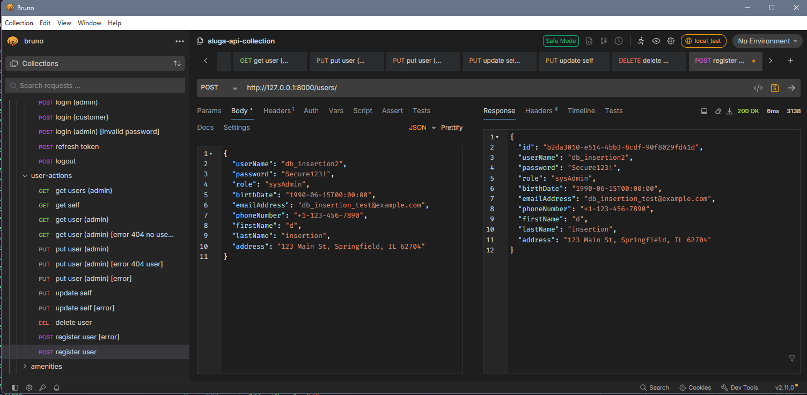


### 16. `POST /users/`
**Purpose**: Fail to register a new user.

- **Request**
  - **Method**: `POST`
  - **URL**: `/users/`
 --- 
- **Expected Result**: HTTP `422 Unprocessable Entity` with No authentication data found, please authenticate.
- **Expected Result**: HTTP `422 Unprocessable Entity` with No authentication data found, please authenticate.
---
- **Actual Result**: ✅ `422 Unprocessable Entity`
- **Actual Result**: ✅ `422 Unprocessable Entity`
---
- **Response Body**:

  ```json
  {
    "detail": [
      {
        "type": "string_pattern_mismatch",
        "loc": [
          "body",
          "emailAddress"
        ],
        "msg": "String should match pattern '^[a-zA-Z0-9._%+-]+@[a-zA-Z0-9.-]+\\.[a-zA-Z]{2,}$'",
        "input": "db_insertion_testexample.com",
        "ctx": {
          "pattern": "^[a-zA-Z0-9._%+-]+@[a-zA-Z0-9.-]+\\.[a-zA-Z]{2,}$"
        }
      }
    ]
  }
  ```
  ```json
  {
    "detail": "User already exists"
  }
  ```
  - Evidences:
  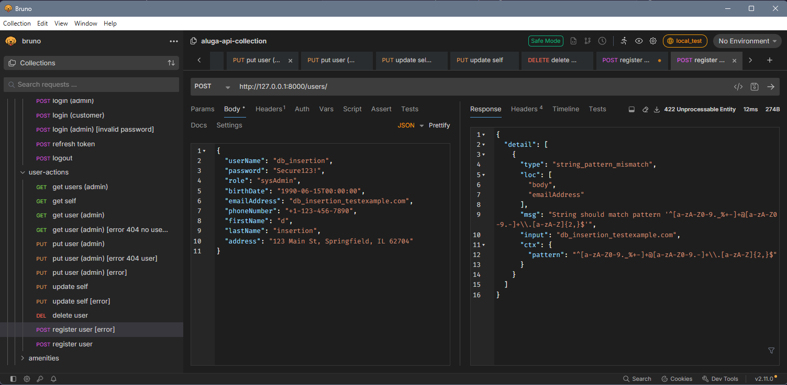
  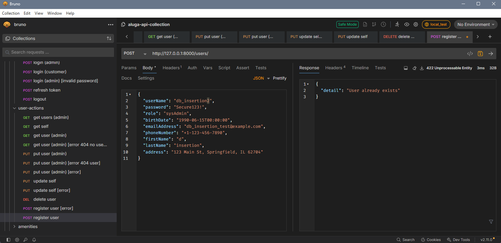